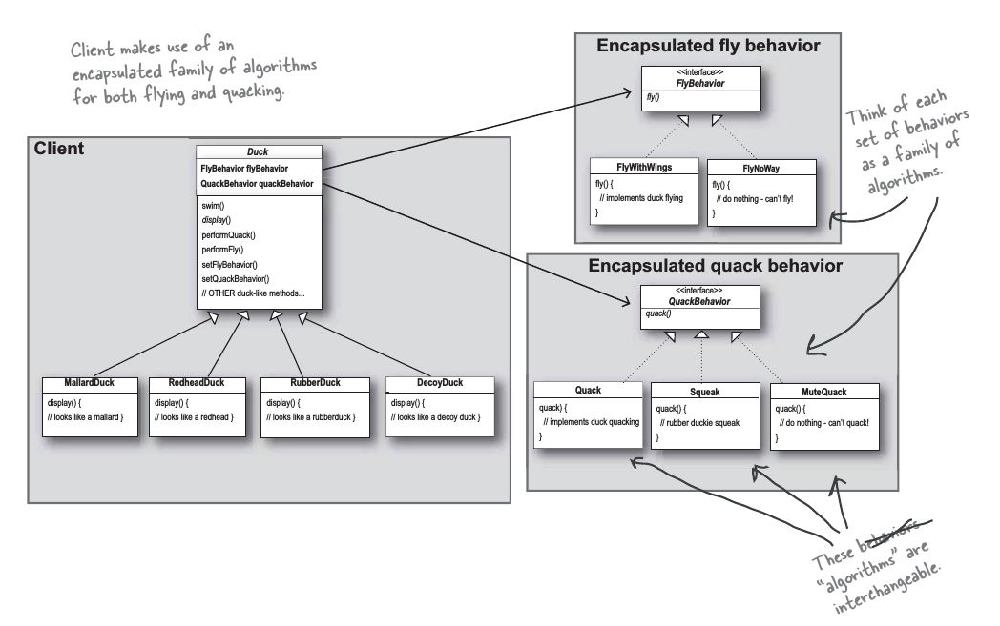
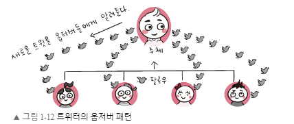
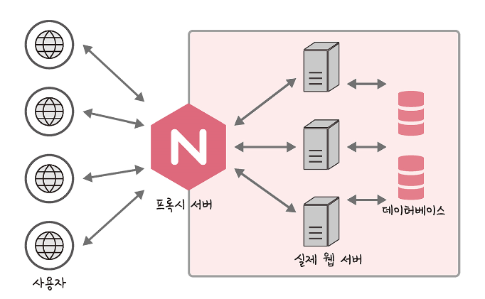
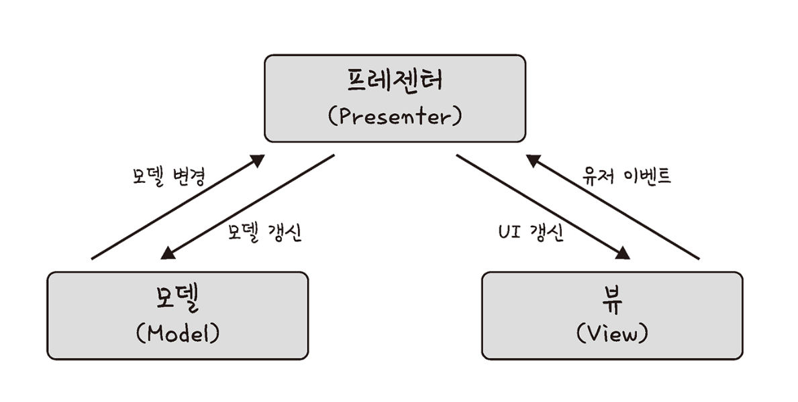
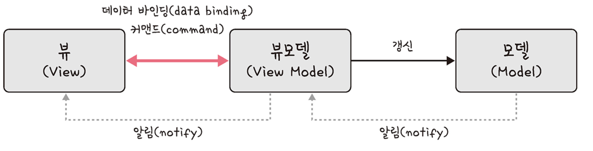

# 1. 디자인 패턴과 프로그래밍 패러다임

## 1.1. 디자인 패턴

### 1.1.1. 싱글톤 패턴

```js
// javascript example code
class Singleton {
    constructor() {
        if(!Singleton.instance){
            Singleton.instance = this;
        }
        return Singleton.instance
    }
    
    getInstance(){
        return this.instance
    }
}

const a = new Singleton()
const b = new Singleton()
console.log(a === b) //true
```

- 싱글톤 패턴은 DB 연결 모듈에 많이 쓰인다.

```js
// DB 연결을 하는 것이기 때문에 비용이 더 높은 작업 
const URL = 'mongodb://localhost:27017/kundolapp' 
const createConnection = url => ({"url" : url})    
class DB {
    constructor(url) {
        if (!DB.instance) { 
            DB.instance = createConnection(url)
        }
        return DB.instance
    }
    connect() {
        return this.instance
    }
}
const a = new DB(URL)
const b = new DB(URL) 
console.log(a === b) // true
```

- 개인적으로는 글로벌한 State를 관리하는 객체 역시 싱글톤으로 구현하면 어떨까 싶다. (책에 있는 내용이 아니라 뇌피셜임..)

- 싱글톤 패턴은 TDD의 걸림돌이 된다. 유닛 테스트를 할 때, 독립적인 인스턴스를 만들 수가 없기 때문이다.


### 1.1.2. Dependency Injection 

- https://www.youtube.com/watch?v=EPv9-cHEmQw
- 위 영상이 교재보다 훨씬 직관적인 설명을 제공한다.

```java
public class User {
    public database: MySqlDatabase;
    
    constructor(){
        this.databse = new MySqlDatabase();
    }
    
    public void add(data: string){
        this.database.persist(data);
    }
}
```

- 위 코드는 `MySqlDatabase`와 아주 강하게 결합되어 있는 구조이다. 
- 이러한 구조를 디펜던시를 주입하는 형태의 구조로 변경하여 유연성을 확보해보자.

```java
public class User {
    public database: Database; 
    // Database는 MySqlDatabase에 대한 Abstract class임..
    
    constructor(database: Database){
        this.databse = database;
    }
    
    public void add(data: string){
        this.database.persist(data);
    }
}
```

- `database: Database` argument를 통해 `User` 클래스에 적절한 데이터베이스를 유연하게 결합할 수 있다.
- 이와 같이 외부에서 디펜던시를 유연하게 설정할 수 있는 형태로 코드를 작성하는 것을 Dependency Injection이라 한다.


### 1.1.3. 팩토리 패턴

```java
abstract class Coffee { 
    public abstract int getPrice(); 
    
    @Override
    public String toString(){
        return "Hi this coffee is "+ this.getPrice();
    }
}

class CoffeeFactory { 
    public static Coffee getCoffee(String type, int price){
        if("Latte".equalsIgnoreCase(type)) return new Latte(price);
        else if("Americano".equalsIgnoreCase(type)) return new Americano(price);
        else{
            return new DefaultCoffee();
        } 
    }
}
class DefaultCoffee extends Coffee {
    private int price;

    public DefaultCoffee() {
        this.price = -1;
    }

    @Override
    public int getPrice() {
        return this.price;
    }
}
class Latte extends Coffee { 
    private int price; 
    
    public Latte(int price){
        this.price=price; 
    }
    @Override
    public int getPrice() {
        return this.price;
    } 
}
class Americano extends Coffee { 
    private int price; 
    
    public Americano(int price){
        this.price=price; 
    }
    @Override
    public int getPrice() {
        return this.price;
    } 
} 
public class HelloWorld{ 
     public static void main(String []args){ 
        Coffee latte = CoffeeFactory.getCoffee("Latte", 4000);
        Coffee ame = CoffeeFactory.getCoffee("Americano",3000); 
        System.out.println("Factory latte ::"+latte);
        System.out.println("Factory ame ::"+ame); 
     }
} 
/*
Factory latte ::Hi this coffee is 4000
Factory ame ::Hi this coffee is 3000
*/
```

- 객체의 생성 부분을 떼어내 추상화한 패턴이다.


### 1.1.4. Strategy Pattern



- 클래스 안에서 사용되는 **알고리즘들을 캡슐화하는 패턴**이다.

- 위의 클래스 다이어그램이 직관적인 이해를 도울 것이다.
- `Duck`의 concrete class들은 다양한 형태의 비행 습성과 꽦꽦 습성을 갖고 있을 것이다. 이를 `FlyBehavior`, `QuackBehavior`라는 인터페이스로 추상화하고 유연하게 선택할 수 있게 하는 패턴이다.


### 1.1.5. 옵저버 패턴



- 사실 개인적으로 구독자 패턴이라는 말을 더 선호한다. 
- 요새 구독 기반 서비스들이 워낙 늘어나다 보니 그게 훨씬 직관적인 표현이 된 것 같다.

```java
import java.util.ArrayList;
import java.util.List;

interface Subject {
    public void register(Observer obj);
    public void unregister(Observer obj);
    public void notifyObservers();
    public Object getUpdate(Observer obj);
}

interface Observer {
    public void update(); 
}

class Topic implements Subject {
    private List<Observer> observers;
    private String message; 

    public Topic() {
        this.observers = new ArrayList<>();
        this.message = "";
    }

    @Override
    public void register(Observer obj) {
        if (!observers.contains(obj)) observers.add(obj); 
    }

    @Override
    public void unregister(Observer obj) {
        observers.remove(obj); 
    }

    @Override
    public void notifyObservers() {   
        this.observers.forEach(Observer::update); 
    }

    @Override
    public Object getUpdate(Observer obj) {
        return this.message;
    } 
    
    public void postMessage(String msg) {
        System.out.println("Message sended to Topic: " + msg);
        this.message = msg; 
        notifyObservers();
    }
}

class TopicSubscriber implements Observer {
    private String name;
    private Subject topic;

    public TopicSubscriber(String name, Subject topic) {
        this.name = name;
        this.topic = topic;
    }

    @Override
    public void update() {
        String msg = (String) topic.getUpdate(this); 
        System.out.println(name + ":: got message >> " + msg); 
    } 
}

public class HelloWorld { 
    public static void main(String[] args) {
        Topic topic = new Topic(); 
        Observer a = new TopicSubscriber("a", topic);
        Observer b = new TopicSubscriber("b", topic);
        Observer c = new TopicSubscriber("c", topic);
        topic.register(a);
        topic.register(b);
        topic.register(c); 
   
        topic.postMessage("amumu is op champion!!"); 
    }
}
/*
Message sended to Topic: amumu is op champion!!
a:: got message >> amumu is op champion!!
b:: got message >> amumu is op champion!!
c:: got message >> amumu is op champion!!
*/ 
```


### 1.1.6. 프록시 서버와 프록시 패턴

- 프록시 패턴은 Subject에 접근하기 전, Subject앞에 Proxy object를 두는 형태의 패턴이다.


#### 1.1.6.1 nginx와 프록시 서버



- 프록시 서버란 서버와 클라이언트 사이에서 클라이언트가 자신을 통해 다른 네트워크 서비스에 간접적으로 접속할 수 있게 해주는 컴퓨터 시스템이나 응용프로그램을 가리킨다.

- nginx는 비동기 이벤트 기반의 구조와 다수의 연결을 효과적으로 처리 가능한 웹 서버이며, 주로 Node.js 서버 앞단의 프록시 서버로 활용된다.


>You just may be hacked when some yet-unkown buffer overflow is discovered. Not that couldn't happen behind nginx, but somehow having a proxy in front makes me happy.
>
>Ryan Dahl

 


> 프록시 서버에서의 캐싱
>
> 캐시 안에 정보를 담아두고, 캐시 안에 있는 정보를 요구하는 요청에 대해 다시 저 멀리 있는 원격 서버에 요청하지 않고 캐시 안에 있는 데이터를 활용하는 것을 말한다. 이를 통해 불필요하게 외부와 연결하지 않기 때문에 트래픽을 줄일 수 있다는 장점이 있다.


#### 1.1.6.2 CloudFlare

- CloudFlare는 전세계적으로 분산된 서버가 있고, 이를 통해 어떠한 시스템의 콘텐츠 전달을 빠르게 할 수 있는 CDN서비스이다.
  - CDN이란 각 사용자가 인터넷과 접속하는 곳과 가까운 곳에서 콘텐츠를 캐싱 또는 배포하는 서버 네트워크를 말한다. 이를 통해 사용자가 웹 서버로부터 콘텐츠를 다운로드하는 시간을 줄일 수 있다.

- CDN말고도 CloudFlare를 사용하면, <mark>DDOS 방어, HTTPS 구축이 가능하다.</mark> 이 모든 것이 웹 서버 앞단에 두어 **프록시 서버**로 쓰기 때문에 가능한 것이다.
  - HTTPS 인증서 없이 HTTPS를 구축하고 싶다면 CloudFlare를 이용하자!

 


#### 1.1.6.3 CORS

- **Cross-Origin Resource Sharing**의 준말이다.

- 8000번 포트로 열고 있는 웹페이지에서 8001번 포트로 요청을 주는 등, origin이 달라지는 상황에서 요청이 막히는 현상이다.
- 서버측에서 특정 요청의 origin을 허용하는 식으로 혹은 프록시 서버를 이용하는 식으로 해제할 수 있다. 


### 1.1.7. 이터레이터 패턴

- <a href="https://howsmyanimeprofilepicture.github.io/head-first-design-pattern/docs/hongkyu/9-2)%20%EC%BB%B4%ED%8F%AC%EC%A7%80%ED%8A%B8%20%ED%8C%A8%ED%84%B4#13-iterator-%ED%8C%A8%ED%84%B4-%EC%A0%81%EC%9A%A9%ED%95%B4%EB%B3%B4%EA%B8%B0">예시코드</a>
- 순회가능한(iterable) 객체에 대해 내부의 아이템들을 순환하는 패턴이다. 
- 특히 트리 구조의 객체의 경우 DFC, BFC 등 다양한 형태의 이터레이터를 구현할 수 있다.


### 1.1.8. MVC 패턴




- 리액트가 MVC패턴을 구현하는 라이브러리라고 한다. 왜인지까지는 모르겠다. 

- https://github.com/howsmyanimeprofilepicture/mvc-pattern-example

- 예전에 해당 패턴을 구현해본 레포가 있어서 같이 첨부해본다. 아주 단순한 구조의 코드지만, 대략적인 MVC 패턴을 담고 있다고 생각한다.


### 1.1.9. MVVM 패턴



- View가 대표적이다.

- 기존 MVC에 C에 해당되는 컨트롤러를 뷰모델로 바꾼 패턴이다.
- 여기서 뷰모델은 뷰를 더 추상화한 계층이며, MVVM 패턴은 MVC패턴과는 다르게 커맨드와 데이터 바인딩을 가지는 것이 특징이다.
- 뷰와 뷰 모델 사이의 양방향 데이터 바인딩을 지원하며, UI를 별도의 코드 수정 없이 재사용할 수 있고, 단위 테스팅이 쉽다는 장점이 있다.


> MVVM 패턴과 뷰
>
> - vue.js는 반응형 프런트엔드 프레임워크이다.
> - `watch`와 `compute` 등으로 쉽게 반응형적인 값들을 구축할 수 있다.
> - 함수를 사용하지 않고 값 대입만으로 변수가 변경된다. (리액트는 `setState`를 써야하는 반면)
> - 양방향 바인딩과 html을 토대로 컴퍼넌트를 구축할 수 있다.


> 데이터바인딩
>
> 화면에 보이는 데이터와 웹 브라우저의 메모리 데이터를 일치시키는 기법으로, 뷰모델(VM)을 변경하면 뷰(V)가 변경된다.


## 1.2. 프로그래밍 패러다임

### 1.2.1. 함수형 프로그래밍

- https://howsmyanimeprofilepicture.github.io/fp101/draft/fp101.html
- 함수들을 중첩하는 식으로 알고리즘을 구성하는 프로그래밍 방식이다. 
- 잘만 사용하면 굉장한 가독성의 아름다운 코드를 작성할 수 있다.
- 특히 자바스크립트랑 파이썬이 함수형 코드 작성할 때 제일 좋은 거 같다. 개인적으로…


### 1.2.2. 객체 지향 프로그래밍

- 클래스들의 상속과 의존 관계를 통해 전체적인 구조를 구성하는 프로그래밍 방식으로 설명하면 되려나?

- [SOLID Principal 정리한 글](https://howsmyanimeprofilepicture.github.io/design-pattern-code-example/DesignPattern/solid/index.html)


## 3. 예상 질문

### 3.1. 옵저버 패턴을 어떻게 구현하나요?

- 먼저 `Subscriber`와 `Publisher`를 구현할 것이다. 그리고 `Publisher`에 `subscribers: Subscriber[]` 멤버를 추가하고, 여기에 구독자 혹은 옵저버들을 매핑할 것이다. 어떠한 정보의 변경이 발생하고 이를 알려야 하는 상황에서는 객체의 그 자체(`this`) 혹은 전달해야 하는 정보(`state`)만 보낼 것이다.


> **모범 답변**
>
> 여러 가지 방법이 있지만 프록시 객체를 써서 하곤 합니다. 프록시 객체를 통해 객체의 속성이나 메서드 변화 등을 감지하고 이를 미리 설정해놓은 옵저버들에게 전달하는 방법으로 구현합니다.


### 3.2. 프록시 서버를 설명하고 사용 사례에 대해 설명해보세요.

- nginx가 주로 프록시 서버로 많이 쓰이며, 특히 node.js로 백엔드 구축할 때, 진짜 서버 앞에서 진짜 서버를 보호해주는 역할을 하는 친구라고 밖에 설명을 못드리겠습니다.


> **모범 답변**
>
> 프록시 서버란 서버 앞단에 둬서, 캐싱, 로깅, 데이터 분석을 서버보다 먼저 처리하는 서버를 말합니다. 이를 통해 포트 번호를 바꿔서 사용자가 실제 서버의 포트에 접근하지 못하게 할 수 있으며, 공격자의 DDOS 공격을 차단하거나 CDN을 프록시 서버로 달아서 캐싱 처리를 용이하게 할 수 있습니다. nginx로 Node.js로 이루어진 서버의 앞단에 둬서 버퍼 오버플로우를 해결하거나 CloudFlare를 둬서 캐싱, 로그 분석 등을 하는 사용 사례가 있습니다.


### 3.3. MVC 패턴을 설명하고, MVVM 패턴과의 차이는 무엇인지 설명해보세요.

- MVC 패턴은 모델, 뷰, 컨트롤러로 구성된 패턴입니다. 모델은 어플리케이션의 state를 지니게 되며, 어플리케이션의 핵심이 되는 컴퍼넌트입니다. 뷰는 표면적인 UI를 담당하고, 커맨드 패턴과 유사하게 뷰에 어떠한 알고리즘들이 이벤트 리스너의 형태로 할당됩니다. 컨트롤러는 model의 state를 조작하는 어플리케이션을 구동하는 알고리즘들이 담겨 있습니다. 
- MVVM패턴은 MVC 패턴의 Controller가 View Model로 바뀐 거라는 것 정도만 알고 잇습니다.


> **모범 답변**
>
> MVC패턴은 모델, 뷰, 컨트롤러로 이루어진 디자인 패턴이며, 앱의 구성 요소를 세가지 역할로 구분하여, 개발 프로세스에서 확장성과 재사용성을 높였습니다. 애플리케이션이 복잡해질수록 모델과 뷰의 관계 또한 복잡해지는 단점이 있습니다.
>
> MVVM 패턴은 MVC의 C에 해당하는 컨트롤ㄹ러가 뷰 모델로 바뀐 패턴입니다. 여기서 뷰모델은 뷰를 더 추상화한 계층이며, MVVM패턴은 MVC 패턴과는 다르게 커맨드와 데이터 바인딩을 가지는 것이 특징입니다. 뷰와 뷰모델 사이의 양방향 데이터 바인딩을 지원하며 UI를 별도의 코드 수정 없이 재사용할 수 있고 단위 테스팅하기 쉽다는 장점이 있습니다.


