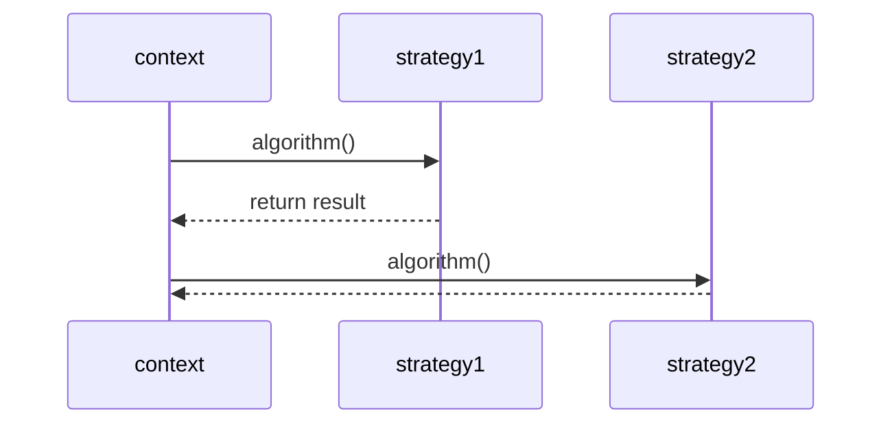
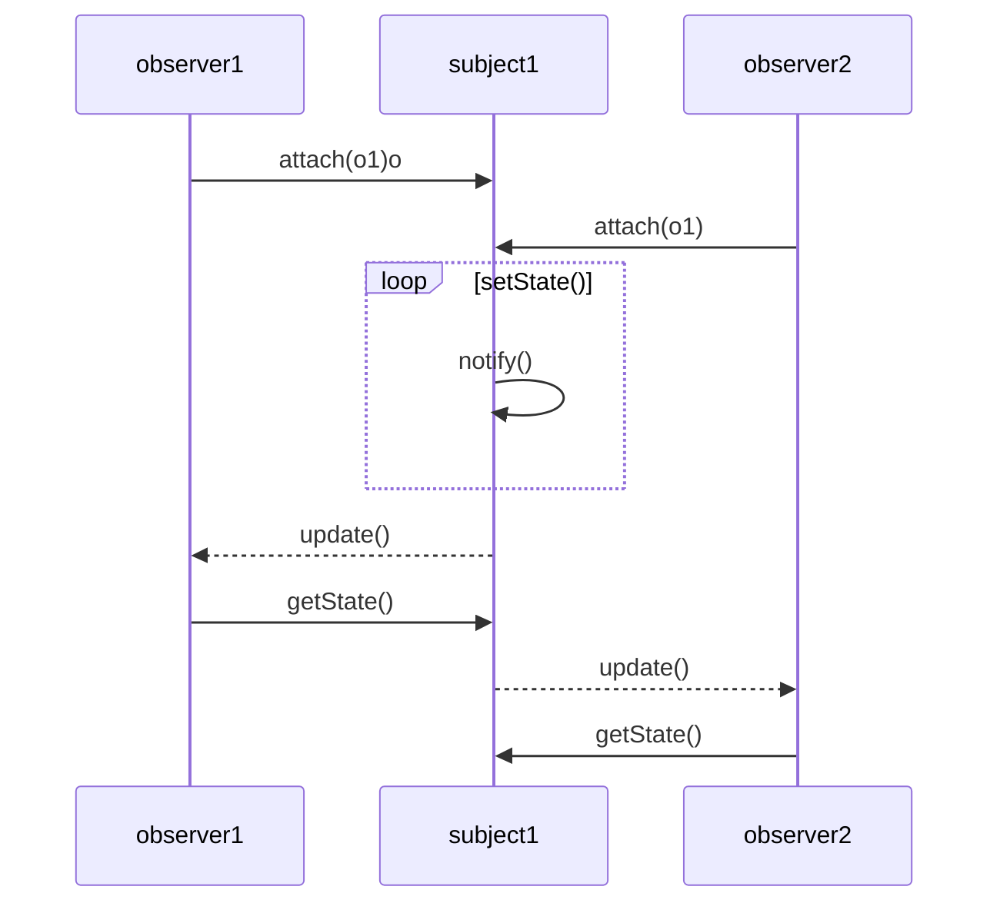
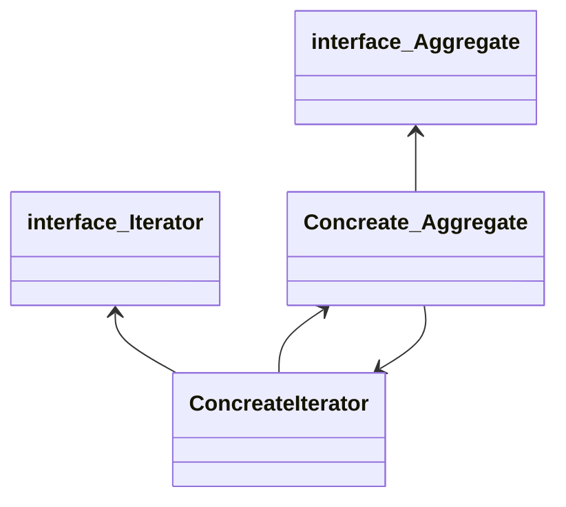

# 0.목차
- [디자인 패턴(Design Pattern)](#1디자인-패턴-design-pattern)
  - [싱글톤 패턴](#11싱글톤-패턴-singleton-pattern)
  - [팩토리 메소드 패턴](#12팩토리-패턴-factory-pattern)
  - [추상 팩토리 패턴](#13abstract-factory-pattern)
  - [전략 패턴](#14전략-패턴strategy-pattern)
  - [옵저버 패턴](#15옵저버-패턴observer-pattern)
  - [프록시 패턴](#16프록시-패턴proxy-pattern)
  - [이터레이터 패턴](#17이터레이터-패턴iterator-pattern)
  - [노출 모듈 패턴](#18노출모듈-패턴revealing-module-pattern)
  - [MVC 패턴](#19mvc-패턴)
  - [MVP 패턴](#110mvp-패턴)
  - [MVVM 패턴](#111mvvm-패턴)
- [프로그래밍 패러다임(programming paradigm)](#2프로그래밍-패러다임programming-paradigm)
- [단어장](#3단어장)

```

# 주제

### Diagram

### 설명

### 사용처

### 단점

### 구현 코드

```
# 1.디자인 패턴 (Design Pattern)
# 1.1.싱글톤 패턴 (singleton pattern)

### Diagram


### 설명
싱글톤 패턴은 인스턴스를 생성할 때 기존의 인스턴스를 재활용하여, *단일 인스턴스*로 제한하는 소프트웨어 설계 패턴이다. 이는 시스템 전체에서 작업을 조정하기 위해 정확히 *하나의 객체*가 필요할 때 유용하다.

구현, 변경, 테스트 및 재사용을 용이하게 한다.
유연하고 재사용 가능한 객체 지향 소프트웨어를 설계하기 위해 반복되는 설계 문제를 해결하는 방법이다.

### 사용처
abstract factory, factory method, builder, prototype 디자인 패턴은 싱글톤을 접목시켜 사용할 수 있다.
Facade 객체는 하나의 Facade 객체 만 필요하기 때문에 종종 싱글톤을 이용한다.
State 객체는 종종 싱글톤을 이용한다.
다음과 같은 이유로 싱글톤이 전역 변수보다 선호되는 경우가 있다.
    - 전역 네임스페이스를 불필요한 변수로 오염시키지 않는다.
    - 대부분의 언어에서 전역 변수는 항상 리소스를 소비하는 반면, 싱글톤은 lazy 할당 및 initialization를 허용한다.

### 단점
싱글톤은 싱글톤을 호출하는 모든 코드에 잠재적 의존성을 도입함으로써 의존성 분석을 복잡하게 만든다.
싱글 톤은 또한 OOP 단일 책임 원칙을 위반하기도 한다.
    - 이것은 정적 방법을 통해 자신의 고유성을 강제하는 "고전적인" 싱글톤의 경우에 해당한다. 의존성 주입(DI, Dependency Injection)을 통해 해결할 수 있다.

싱글톤이 런타임 동안 글로벌 상태를 반영하기 때문에 테스트가 어려워진다. 단위 테스트는 테스트되는 것을 분리하기 위해 느슨하게 결합된 클래스를 필요로 하다. 그러나 특정 클래스가 싱글톤과 상호 작용할 때 해당 클래스와 싱글톤이 긴밀하게 결합되므로 싱글톤을 테스트하지 않고는 클래스를 자체적으로 테스트할 수 없어진다.

### 샘플  코드
```dart
class ApiConnector {
  static final ApiConnector _singleton = new ApiConnector._internal();
  static final String _env = "sample";

  factory ApiConnector() {
    return _singleton;
  }

  static String get env => _env;
 
  @override
  String toString() => "Hello, this env is $env.";

  ApiConnector._internal();
}

void main() {
  var connector = ApiConnector();
  var anotherConnector = ApiConnector();
  
  print(connector);
  print(anotherConnector);

  var sameChecker = identical(connector, anotherConnector)
      ? "is same ${ApiConnector.env}."
      : "is not same.";
  print(sameChecker);

  /*
    Hello, this env is sample.
    Hello, this env is sample.
    is same sample.
  */
}
```
# 1.2.팩토리 패턴 (factory pattern)

## Factory method pattern

### Diagram


### 설명
Factory Method 설계 패턴은 반복적인 설계 문제를 해결하고 유연하고 재사용 가능한 객체 지향 소프트웨어, 즉 구현, 변경, 테스트 및 재사용이 용이한 객체를 설계하는 방법이다.

Factory Method 설계 패턴은 다음과 같은 문제를 해결할 수 있다.
  - 서브클래스가 인스턴스화할 클래스를 재정의할 수 있도록 오브젝트를 작성하려면 어떻게 해야하는가?
  - 클래스가 인스턴스화를 서브클래스로 연기하려면 어떻게 해야 하는가?

### 사용처
클래스가 어떤 객체 클래스를 작성해야하는지 모를 때 제공된 데이터에 따라 하위 클래스 중 하나의 객체를 만들어야하는 팩토리 패턴을 사용할 수 있다.

### 샘플  코드
```dart
 main() {
  TVObj = TV(param1, param2, param3);
  LivingroomObj = LivingRoom(TVObj, param1, param2);
  KitchenroomObj = Kitchen(param1, param2);
  HouseObj = House(LivingroomObj, KitchenroomObj);
 }
```
```dart
class HouseFactory {
    create() {
        TVObj =  TV(param1, param2, param3);
        LivingroomObj =  LivingRoom(TVObj, param1, param2);
        KitchenroomObj =  Kitchen(param1, param2);
        HouseObj =  House(LivingroomObj, KitchenroomObj);

        return HouseObj;
    }
}

 main() {
  houseFactory =  HouseFactory();
  HouseObj = houseFactory.create();
 }

```

## 1.3.Abstract factory pattern

### Diagram


### 설명
Abstract Factory Pattern의 본질은 "구체적인 클래스를 지정하지 않고 관련 객체 또는 종속 객체의 패밀리를 작성하기 위한 인터페이스를 제공하는 것"이다.

Abstract Factory 설계 패턴은 다음과 같은 문제를 해결할 수 있다.

응용 프로그램이 개체 생성 방법과 어떻게 독립적일 수 있는가?
클래스가 필요한 오브젝트 작성 방법과 어떻게 독립적일 수 있는가?
관련 객체 또는 종속 객체의 패밀리를 작성하려면 어떻게 해야 하는가?

### 샘플  코드
```dart
abstract class Drinkable {
  void pour();
}

class Beer implements Drinkable {
  void pour() {
    print("Pouring a delicious beer!");
  }
}

class Coffee implements Drinkable {
  void pour() {
    print("Pouring a refreshing coffee!");
  }
}

abstract class DrinkFactory {
  Drinkable createDrink();
}

class Pub implements DrinkFactory {
  Drinkable createDrink() {
    return Beer();
  }
}

class CoffeeShop implements DrinkFactory {
  Drinkable createDrink() {
    return Coffee();
  }
}

void main() {
  var mood = "sleepy";
  DrinkFactory destination;

  switch(mood) {
    case "sleepy": destination = CoffeeShop(); break;
    case "done": destination = Pub(); break;
    default: print("I only have two moods...");
  }

  var myBeverage = destination.createDrink();
  myBeverage.pour();

  /*
     Pouring a refreshing coffee!
  */
}
```
# 1.4.전략 패턴(strategy pattern)

### Diagram


### 설명
전략 패턴(strategy pattern)은 정책 패턴(policy pattern)이라고도 하며, 객체의 행위를 바꾸고 싶은 경우 단일 알고리즘을 직접 구현하는 대신 전략이라고 부르는 ‘캡슐화한 알고리즘’을 컨텍스트 안에서 바꿔주면서 상호 교체가 가능하게 만드는 패턴이다.

<!-- ### 사용처
예를 들어, 착신 데이터에 대해 검증을 수행하는 클래스는 데이터 유형, 데이터 소스, 사용자 선택 또는 기타 식별 요소에 따라 전략 패턴을 사용하여 검증 알고리즘을 선택할 수 있다.이러한 요인은 런타임까지 파악되지 않으며 완전히 다른 검증을 수행해야 할 수 있다.검증 개체와는 별도로 캡슐화된 검증 알고리즘(전략)은 코드 복제 없이 시스템의 다른 영역(또는 다른 시스템)에 있는 다른 검증 개체에 의해 사용될 수 있다.

일반적으로 전략 패턴은 데이터 구조의 일부 코드에 대한 참조를 저장하고 검색한다.이는 네이티브 함수 포인터, 퍼스트 클래스 함수, 객체 지향 프로그래밍 언어의 클래스 또는 클래스 인스턴스와 같은 메커니즘에 의해 달성되거나 언어 구현의 내부 코드 스토리지에 리플렉션을 통해 액세스할 수 있다. -->


### 샘플  코드
```dart
abstract class CoffeeStrategy {
  String announce(String roast);
}

class AmericanoStrategy implements CoffeeStrategy {
  String announce(String roast) => "an Americano with $roast beans";
}

class DripStrategy implements CoffeeStrategy {
  String announce(String roast) => "a drip coffee with $roast beans";
}

class MochaFrappuccinoStrategy implements CoffeeStrategy {
  String announce(String roast) => "a delicious mocha frappuccion with $roast beans";
}

class CoffeeDrinker {
  CoffeeStrategy preferredDrink;
  String name;
  CoffeeDrinker(this.name, this.preferredDrink);
}

void main() {
  var americano = AmericanoStrategy();
  var drip = DripStrategy();
  var mocha = MochaFrappuccinoStrategy();

  var me = CoffeeDrinker("Tyler", drip);
  var europeanBuddy = CoffeeDrinker("Pieter", americano);
  var myDaughter = CoffeeDrinker("Joanie", mocha);

  final String roastOfTheDay = "Italian";

  for (var person in [me, europeanBuddy, myDaughter]) {
    print("Hey ${person.name}, whatcha drinkin' over there?");
    print("I'm enjoying ${person.preferredDrink.announce(roastOfTheDay)}!\r\n");
  }

  /*
    Hey Tyler, whatcha drinkin' over there?
    I'm enjoying a drip coffee with Italian beans!
    Hey Pieter, whatcha drinkin' over there?
    I'm enjoying an Americano with Italian beans!
    Hey Joanie, whatcha drinkin' over there?
    I'm enjoying a delicious mocha frappuccion with Italian beans!
  */
}
```

# 1.5.옵저버 패턴(observer pattern)

### Diagram


### 설명
옵저버 패턴(observer pattern)은 주체가 어떤 객체(subject)의 상태 변화를 관찰하다가 상태 변화가 있을 때마다 메서드 등을 통해 옵저버 목록에 있는 옵저버들에게 변화를 알려주는 디자인 패턴이다.
여기서 주체란 객체의 상태 변화를 보고 있는 관찰자이며, 옵저버들이란 이 객체의 상태 변화에 따라 전달되는 메서드 등을 기반으로 ‘추가 변화 사항’이 생기는 객체들을 의미한다.

<!-- 
The observer pattern is a software design pattern in which an object, called the subject, maintains a list of its dependents, called observers, and notifies them automatically of any state changes, usually by calling one of their methods.

It is mainly used to implement distributed event handling systems, in "event driven" software. Most modern languages such as C# have built-in "event" constructs which implement the observer pattern components.

The observer pattern is also a key part in the familiar model–view–controller (MVC) architectural pattern. The observer pattern is implemented in numerous programming libraries and systems, including almost all GUI toolkits.
 -->
### 사용처
알림, 이메일, 메시지 등을 보내는 데 사용된다.

### 단점
옵저버 패턴은 신중하게 구현하지 않으면 복잡도 높은 코드 및 메모리 누수 문제가 있게 된다.

### 샘플  코드
```dart
class Notification {
  String message;
  DateTime timestamp;
  Notification(this.message, this.timestamp);
  Notification.forNow(this.message) {
    timestamp = new DateTime.now();
  }
}

class Observable {
  List<Observer> _observers;

  Observable([List<Observer> observers]) {
    _observers = observers ?? [];
  }

  void registerObserver(Observer observer) {
    _observers.add(observer);
  }

  void notify_observers(Notification notification) {
    for (var observer in _observers) {
      observer.notify(notification);
    }
  }
}

class Observer {
  String name;
  
  Observer(this.name);

  void notify(Notification notification) {
    print("[${notification.timestamp.toIso8601String()}] Hey $name, ${notification.message}!");
  }
}

class CoffeeMaker extends Observable {
  CoffeeMaker([List<Observer> observers]) : super(observers);
  void brew() {
    print("Brewing the coffee...");
    notify_observers(Notification.forNow("coffee's done"));
  }
}

void main() {
  var me = Observer("Tyler");
  var mrCoffee = CoffeeMaker(List.from([me]));
  var myWife = Observer("Kate");
  mrCoffee.registerObserver(myWife);
  mrCoffee.brew();
  /*
    Brewing the coffee...
    [2019-06-18T07:30:04.397518] Hey Tyler, coffee's done!
    [2019-06-18T07:30:04.397518] Hey Kate, coffee's done!
  */
}
```
# 1.6.프록시 패턴(proxy pattern)

### Diagram


### 설명
<!-- 
A proxy, in its most general form, is a class functioning as an interface to something else. The proxy could interface to anything: a network connection, a large object in memory, a file, or some other resource that is expensive or impossible to duplicate. In short, a proxy is a wrapper or agent object that is being called by the client to access the real serving object behind the scenes.
 -->
프록시 패턴(proxy pattern)은 대상 객체(subject)에 접근하기 전 그 접근에 대한 흐름을 가로채 대상 객체 앞단의 인터페이스 역할을 하는 디자인 패턴이다.

프록시를 사용하면 개체에 액세스하는 동안 특정 조건을 확인할 수 있으며 잠재적으로 "위험한" 클래스와 리소스의 제어된 사용이 적용되어 보안 위협을 막을 수 있다

일부 객체는 메모리 및 실행 시간 측면에서 매우 까다로울 수 있다. 프록시를 사용하면 비용이 많이 드는 작업으로 이러한 객체를 래핑하여 실제로 필요할 때만 호출되거나 불필요한 인스턴스화를 피하여 성능을 높일 수 있다.

### 사용처
ex) 프록시 서버
프록시 서버(proxy server)는 서버와 클라이언트 사이에서 클라이언트가 자신을 통해 다른 네트워크 서비스에 간접적으로 접속할 수 있게 해주는 컴퓨터 시스템이나 응용 프로그램을 실행시킨다.

### 단점
프록시를 사용하여, 필요할 때만 호출되거나 불필요한 인스턴스화를 피하여 성능을 높일 수 있으나, 동시에 성능이 프록시 패턴의 단점이 될 수 있다. 프록시 개체가 네트워크 어딘가에 존재하는 개체를 랩하는 데 사용된다고 가정했을때. 이것은 프록시이므로 원격 통신이 관련되어 있다는 사실을 클라이언트로부터 숨길 수 있다.
이는 결과적으로 클라이언트가 백그라운드에서 값비싼 네트워크 호출이 이루어지고 있다는 것을 인식하지 못하기 때문에 비효율적인 코드를 작성하려는 경향을 만들 수 있다.


### 샘플  코드
```dart
abstract class Subject {
  void someMethod();
}

class ExpensiveClass implements Subject {
  String name;

  ExpensiveClass(this.name);

  void someMethod() {
    print("someMethod of $name (an ExpensiveClass) is being called");
  }
}

class Proxy implements Subject {
  String _name;
  ExpensiveClass _sub;

  Proxy(this._name);

  void someMethod() {
    print("someMethod of $_name (a Proxy) is being called");
    _subject().someMethod();
  }

  ExpensiveClass _subject() {
    if (_sub != null) return _sub;
    print("Creating an instance of ExpensiveClass for the proxy...");
    _sub = ExpensiveClass(_name);
    return _sub;
  }
}

void main() {
  var proxy = Proxy("yay");
  print("With our handy proxy, we call someMethod...\r\n");
  proxy.someMethod();
  print("\r\nNotice that the proxy did not have an instance of ExpensiveClass, so it made one when required.");
  print("Now if we call someMethod again...\r\n");
  proxy.someMethod();
  print("\r\nWe reuse the instance we made above!");
}
```
# 1.7.이터레이터 패턴(iterator pattern)

### Diagram

### 설명
<!-- 
In object-oriented programming, the iterator pattern is a design pattern in which an iterator is used to traverse a container and access the container's elements. The iterator pattern decouples algorithms from containers; in some cases, algorithms are necessarily container-specific and thus cannot be decoupled.

For example, the hypothetical algorithm SearchForElement can be implemented generally using a specified type of iterator rather than implementing it as a container-specific algorithm. This allows SearchForElement to be used on any container that supports the required type of iterator.
 -->
이터레이터 패턴(iterator pattern)은 이터레이터(iterator)를 사용하여 컬렉션(collection)의 요소들에 접근하는 디자인 패턴이다.
이를 통해 순회할 수 있는 여러 가지 자료형의 구조와는 상관없이 이터레이터라는 하나의 인터페이스로 순회가 가능해진다.

### 단점
복잡한 구조가 필요하지 않은 간단한 응용 프로그램에서 자원의 과잉으로 판명 될 수 있다.
Iterator 메서드를 사용하면 간단한 응용 프로그램이 복잡해진다.
반복자를 사용하여 요소에 액세스하는 것은, 요소에 직접 액세스하는 것보다 효율성이 좋지 않다.

### 샘플  코드
```dart
// NOTE: See https://api.dartlang.org/stable/2.4.0/dart-core/Iterator-class.html
// for details on Dart's Iterator class.

class RainbowIterator implements Iterator {
  var _colors = ["Red", "Orange", "Yellow", "Green", "Blue", "Indigo", "Violet"];
  var _index = 0;
  String get current => _colors[_index++];
  bool moveNext() => _index < _colors.length;
}

void main() {
  var rainbowColors = RainbowIterator();
  while(rainbowColors.moveNext()) {
    print(rainbowColors.current);
  }

  /*
    Red
    Orange
    Yellow
    Green
    Blue
    Indigo
    Violet
  */
}
```
# 1.8.노출모듈 패턴(revealing module pattern)


### 설명
노출모듈 패턴(revealing module pattern)은 즉시 실행 함수를 통해 private, public 같은 접근 제어자를 만드는 패턴을 말한다. 자바스크립트는 private나 public 같은 접근 제어자가 존재하지 않고 전역 범위에서 스크립트가 실행된다. 그렇기 때문에 노출모듈 패턴을 통해 private와 public 접근 제어자를 구현하기도 한다.

이 패턴을 사용하면 스크립트의 구문이 더 일관되게 유지될 수 있다. 또한 모듈 끝에서 어떤 기능과 변수에 공개적으로 액세스 할 수 있는지 쉽게 알 수 있으므로 가독성이 좋아진다.

### 단점
이 패턴의 단점은 private 함수가 공용 함수를 참조하는 경우 패치 가 필요한 경우 공용 함수를 재정의 할 수 없다는 것이다. 이는 private 함수가 개인 구현을 계속 참조하고 패턴이 공개 멤버에는 적용되지 않고 기능에만 적용되기 때문이다.

개인 변수를 참조하는 공용 개체 멤버도 패치 없음 규칙의 적용을 받는다.

그 결과, Revealing Module 패턴으로 만든 모듈은 원래 Module 패턴으로 만든 모듈보다 더 취약할 수 있으므로 사용 중에 주의해야 한다.

### 샘플  코드
```javascript
var myRevealingModule = function () {

        var privateVar = "Ben Cherry",
            publicVar  = "Hey there!";

        function privateFunction() {
            console.log( "Name:" + privateVar );
        }
        
        function publicSetName( strName ) {
            privateVar = strName;
        }

        function publicGetName() {
            privateFunction();
        }


        // Reveal public pointers to  
        // private functions and properties

        return {
            setName: publicSetName,
            greeting: publicVar,
            getName: publicGetName
        };

    }();

myRevealingModule.setName( "Paul Kinlan" );
```

```javascript
var myRevealingModule = function () {

        var privateCounter = 0;

        function privateFunction() {
            privateCounter++;
        }

        function publicFunction() {
            publicIncrement();
        }

        function publicIncrement() {
            privateFunction();
        }

        function publicGetCount(){
          return privateCounter;
        }

        // Reveal public pointers to 
        // private functions and properties        

       return {
            start: publicFunction,
            increment: publicIncrement,
            count: publicGetCount
        };

    }();

myRevealingModule.start();
```

# 1.9.MVC 패턴

### Diagram


### 설명
MVC는 모델-뷰-컨트롤러의 약자다. 거대한 응용 프로그램을 쉽게 만들 수있는 아키텍처 또는 소프트웨어 디자인 패턴이다.

### 단점
응용 프로그램을 개발하는 데 복잡성이 높으며, 작은 응용 프로그램에는 적합하지 않다.

### 샘플  코드
```dart

```

# 1.10.MVP 패턴
### Diagram


### 설명
MVP 패턴은 MVC 패턴으로부터 파생되었으며 MVC에서 C에 해당하는 컨트롤러가 프레젠터(presenter)로 교체된 패턴이다.

뷰와 프레젠터는 일대일 관계이기 때문에 MVC 패턴보다 더 강한 결합을 지닌 디자인 패턴이라고 볼 수 있다.

V-P와 P-M 간의 통신은 인터페이스를 통해 이루어진다.
하나의 프레젠터 클래스가 한 번에 하나의 뷰를 관리하므로 프레젠터와 뷰 사이에 일대일 관계가 있다.
Model 및 View 클래스에는 서로의 존재에 대한 지식이 없다.

### 샘플  코드
```dart

```

# 1.11.MVVM 패턴
### Diagram

### 설명
MVVM 패턴은 MVC의 C에 해당하는 컨트롤러가 뷰모델(view model)로 바뀐 패턴이다.

여기서 뷰모델은 뷰를 더 추상화한 계층이며, MVVM 패턴은 MVC 패턴과는 다르게 커맨드와 데이터 바인딩을 가지는 것이 특징이다. 뷰와 뷰모델 사이의 양방향 데이터 바인딩을 지원하며 UI를 별도의 코드 수정 없이 재사용할 수 있고 단위 테스팅하기 쉽다는 장점이 있다.

### 샘플  코드
```dart

```
# 2.프로그래밍 패러다임(programming paradigm)

프로그래밍 패러다임(programming paradigm)은 프로그래머에게 프로그래밍의 관점을 갖게 해주는 역할을 하는 개발 방법론이다.
프로그래밍 패러다임은 크게 선언형, 명령형으로 나누며, 선언형은 함수형이라는 하위 집합을 갖는다. 또한, 명령형은 다시 객체지향, 절차지향으로 나눈다.

# 2.1.0.선언형과 함수형 프로그래밍

함수형 프로그래밍(functional programming)은 선언형 패러다임의 일종이다. 선언형 프로그래밍(declarative programming)이란 ‘무엇을’ 풀어내는가에 집중하는 패러다임이며, “프로그램은 함수로 이루어진 것이다.”라는 명제가 담겨 있는 패러다임이다. 
``` javascript
// 자연수로 이루어진 배열에서 최댓값을 찾아라
const ret = [1, 2, 3, 4, 5, 11, 12]
.reduce((max, num) => num > max ? num : max, 0)
console.log(ret) // 12
```
앞의 코드에서 reduce()는 ‘배열’만 받아서 누적한 결괏값을 반환하는 순수 함수다.

함수형 프로그래밍은 이와 같은 작은 ‘순수 함수’들을 블록처럼 쌓아 로직을 구현하고 ‘고차 함수’를 통해 재사용성을 높인 프로그래밍 패러다임이다. 자바스크립트는 단순하고 유연한 언어이며, 함수가 일급 객체이기 때문에 객체지향 프로그래밍보다는 함수형 프로그래밍 방식이 선호된다.

# 2.1.1.순수 함수
출력이 입력에만 의존하는 것을 의미한다.
``` javascript
// 자연수로 이루어진 배열에서 최댓값을 찾아라
const pure = (a, b) => {
    return a + b
}
```
pure 함수는 들어오는 매개변수 a, b에만 영향을 받는다. 만약 a, b 말고 다른 전역 변수 c 등이 이 출력에 영향을 주면 순수 함수가 아니다.

# 2.1.2.고차 함수
고차 함수란 함수가 함수를 값처럼 매개변수로 받아 로직을 생성할 수 있는 것을 말한다.

 
일급 객체
이때 고차 함수를 쓰기 위해서는 해당 언어가 일급 객체라는 특징을 가져야 하며 그 특징은 다음과 같다.

• 변수나 메서드에 함수를 할당할 수 있다.
• 함수 안에 함수를 매개변수로 담을 수 있다.
• 함수가 함수를 반환할 수 있다.
 
참고로 함수형 프로그래밍은 이외에도 커링, 불변성 등 많은 특징이 있다.

# 2.2.1.객체지향 프로그래밍

객체지향 프로그래밍(OOP, Object-Oriented Programming)은 객체들의 집합으로 프로그램의 상호 작용을 표현하며 데이터를 객체로 취급하여 객체 내부에 선언된 메서드를 활용하는 방식을 말한다. 설계에 많은 시간이 소요되며 처리 속도가 다른 프로그래밍 패러다임에 비해 상대적으로 느리다.

``` javascript
// 자연수로 이루어진 배열에서 최댓값을 찾으라
const ret = [1, 2, 3, 4, 5, 11, 12]
class List {
    constructor(list) {
        this.list = list
        this.mx = list.reduce((max, num) => num > max ? num : max, 0)
    }
    getMax() {
        return this.mx
    }
}
const a = new List(ret)
console.log(a.getMax()) // 12
```

객체지향 프로그래밍의 특징
객체지향 프로그래밍은 추상화, 캡슐화, 상속성, 다형성이라는 특징이 있다.

설계 원칙
객체지향 프로그래밍을 설계할 때는 SOLID 원칙을 지켜야한다. S는 단일 책임 원칙, O는 개방-폐쇄 원칙, L은 리스코프 치환 원칙, I는 인터페이스 분리 원칙, D는 의존 역전 원칙을 의미한다.

# 2.3.1.절차형 프로그래밍
절차형 프로그래밍은 로직이 수행되어야 할 연속적인 계산 과정으로 이루어져 있다. 일이 진행되는 방식으로 그저 코드를 구현하기만 하면 되기 때문에 코드의 가독성이 좋으며 실행 속도가 빠르다. 그렇기 때문에 계산이 많은 작업 들에 쓰인다. 대표적으로 포트란(fortran)을 이용한 대기 과학 관련 연산 작업, 머신 러닝의 배치 작업이 있다. 단점으로는 모듈화하기가 어렵고 유지 보수성이 떨어진다는 점이 있다.

예를 들어 자연수로 이루어진 배열에서 최댓값을 찾으라고 한다면 다음과 같이 로직을 구성한다.

``` javascript
const ret = [1, 2, 3, 4, 5, 11, 12]
let a = 0
for (let i = 0; i < ret.length; i++) {
    a = Math.max(ret[i], a)
}
console.log(a) // 12
```

  # 3.단어장
- [ ] 라이브러리 :   
공통으로 사용될 수 있는 특정한 기능들을 모듈화한 것을 의미한다. 폴더명, 파일명 등에 대한 규칙이 없고 프레임워크에 비해 자유롭다. 예를 들어 무언가를 자를 때 ‘도구’인 ‘가위’를 사용해서 ‘내가’ 직접 컨트롤하여 자르는데, 라이브러리는 이와 비슷하다.

- [ ] 프레임워크 :   
공통으로 사용될 수 있는 특정한 기능들을 모듈화한 것을 의미한다. 폴더명, 파일명 등에 대한 규칙이 있으며 라이브러리에 비해 좀 더 엄격하다. 다른 곳으로 이동할 때 ‘도구’인 비행기를 타고 이동하지만 ‘비행기’가 컨트롤하고 나는 가만히 앉아 있어야 한다. 프레임워크는 이와 비슷하다.

- [ ] Enum :   
상수의 집합을 정의할 때 사용되는 타입이다. 상수나 메서드 등을 집어넣어서 관리하며 코드를 리팩터링할 때 해당 집합에 관한 로직 수정 시 이 부분만 수정하면 되므로 코드 리팩터링 시 강점이 생긴다.

- [ ] 컨텍스트 :   
프로그래밍에서의 컨텍스트는 상황, 맥락, 문맥을 의미하며 개발자가 어떠한 작업을 완료하는 데 필요한 모든 관련 정보를 말한다.

- [ ] DOM(Document Object Model) :   
문서 객체 모델을 말하며, 웹 브라우저상의 화면을 이루고 있는 요소들을 지칭한다.

- [ ] 프록시 서버에서의 캐싱 :   
캐시 안에 정보를 담아두고, 캐시 안에 있는 정보를 요구하는 요청에 대해 다시 저 멀리 있는 원격 서버에 요청하지 않고 캐시 안에 있는 데이터를 활용하는 것을 말한다. 이를 통해 불필요하게 외부와 연결하지 않기 때문에 트래픽을 줄일 수 있다는 장점이 있다.

- [ ] 버퍼 오버플로우 :   
버퍼는 보통 데이터가 저장되는 메모리 공간으로, 메모리 공간을 벗어나는 경우를 말한다. 이때 사용되지 않아야 할 영역에 데이터가 덮어씌워져 주소, 값을 바꾸는 공격이 발생하기도 한다.
 
- [ ] gzip 압축 :   
LZ77과 Huffman 코딩의 조합인 DEFLATE 알고리즘을 기반으로 한 압축 기술이다. gzip 압축을 하면 데이터 전송량을 줄일 수 있지만, 압축을 해제했을 때 서버에서의 CPU 오버헤드도 생각해서 gzip 압축 사용 유무를 결정해야 한다.

- [ ] CDN(Content Delivery Network) :   
각 사용자가 인터넷에 접속하는 곳과 가까운 곳에서 콘텐츠를 캐싱 또는 배포하는 서버 네트워크를 말한다. 이를 통해 사용자가 웹 서버로부터 콘텐츠를 다운로드하는 시간을 줄일 수 있다.

- [ ] 오리진 :   
프로토콜과 호스트 이름, 포트의 조합을 말한다. 예를 들어 https://kundol.com:12010/test라는 주소에서 오리진은 https://kundol.com:12010을 뜻한다.

- [ ] 이터레이터 프로토콜 :   
이터러블한 객체들을 순회할 때 쓰이는 규칙
 
- [ ] 이터러블한 객체 :   
반복 가능한 객체로 배열을 일반화한 객체

- [ ] public :   
클래스에 정의된 함수에서 접근 가능하며 자식 클래스와 외부 클래스에서 접근 가능한 범위
 
- [ ] protected :   
클래스에 정의된 함수에서 접근 가능, 자식 클래스에서 접근 가능하지만 외부 클래스에서 접근 불가능한 범위
 
- [ ] private :   
클래스에 정의된 함수에서 접근 가능하지만 자식 클래스와 외부 클래스에서 접근 불가능한 범위
 
- [ ] 즉시 실행 함수 :   
함수를 정의하자마자 바로 호출하는 함수. 초기화 코드, 라이브러리 내 전역 변수의 충돌 방지 등에 사용한다.

- [ ] 커맨드 :   
여러 가지 요소에 대한 처리를 하나의 액션으로 처리할 수 있게 하는 기법이다.

- [ ] 데이터 바인딩 :   
화면에 보이는 데이터와 웹 브라우저의 메모리 데이터를 일치시키는 기법으로, 뷰모델을 변경하면 뷰가 변경된다.
 
- [ ] 상속(extends) :   
자식 클래스가 부모 클래스의 메서드 등을 상속받아 사용하며 자식 클래스에서 추가 및 확장을 할 수 있는 것을 말합니다. 이로 인해 재사용성, 중복성의 최소화가 이루어집니다. 상속은 일반 클래스, abstract 클래스를 기반으로 구현합니다.

- [ ] 구현(implements) :   
부모 인터페이스(interface)를 자식 클래스에서 재정의하여 구현하는 것을 말하며, 상속과는 달리 반드시 부모 클래스의 메서드를 재정의하여 구현해야 합니다. 인터페이스를 기반으로 구현합니다.

- [ ] 모델(model) :   
애플리케이션의 데이터인 데이터베이스, 상수, 변수 등을 뜻합니다.

- [ ] 뷰(view) :   
inputbox, checkbox, textarea 등 사용자 인터페이스 요소를 나타냅니다. 즉, 모델을 기반으로 사용자가 볼 수 있는 화면을 뜻합니다. 모델이 가지고 있는 정보를 따로 저장하지 않아야 하며 단순히 사각형 모양 등 화면에 표시하는 정보만 가지고 있어야 합니다.
또한, 변경이 일어나면 컨트롤러에 이를 전달해야 합니다.

- [ ] 컨트롤러(controller) :   
하나 이상의 모델과 하나 이상의 뷰를 잇는 다리 역할을 하며 이벤트 등 메인 로직을 담당합니다. 또한, 모델과 뷰의 생명주기도 관리하며, 모델이나 뷰의 변경 통지를 받으면 이를 해석하여 각각의 구성 요소에 해당 내용에 대해 알려줍니다.

- [ ] 추상화(abstraction):   
복잡한 시스템으로부터 핵심적인 개념 또는 기능을 간추려내는 것을 의미합니다. 예를 들어 필자의 후배 종화에게는 군인, 장교, 키180, 여친있음, 안경씀, 축구못함, 롤마스터티어 등의 특징이 있습니다. 이러한 특징 중에서 코드로 나타낼 때 일부분의 특징인 군인, 장교만 뽑아내거나 조금 더 간추려서 나타내는 것을 말합니다.

- [ ] 캡슐화(encapsulation) :   
객체의 속성과 메서드를 하나로 묶고 일부를 외부에 감추어 은닉하는 것을 말합니다.

- [ ] 상속성(inheritance) :   
상위 클래스의 특성을 하위 클래스가 이어받아서 재사용하거나 추가, 확장하는 것을 말합니다. 코드의 재사용 측면, 계층적인 관계 생성, 유지 보수성 측면에서 중요합니다.

- [ ] 다형성(polymorphism) :   
하나의 메서드나 클래스가 다양한 방법으로 동작하는 것을 말합니다. 대표적으로 오버로딩, 오버라이딩이 있습니다.

- [ ] 오버로딩(overloading) :   
같은 이름을 가진 메서드를 여러 개 두는 것을 말합니다. 메서드의 타입, 매개변수의 유형, 개수 등으로 여러 개를 둘 수 있으며 컴파일 중에 발생하는 ‘정적’ 다형성입니다.

- [ ] 오버라이딩(overriding) :   
주로 메서드 오버라이딩(method overriding)을 말하며 상위 클래스로부터 상속받은 메서드를 하위 클래스가 재정의하는 것을 의미합니다.
이는 런타임 중에 발생하는 ‘동적’ 다형성입니다.

- [ ] 단일 책임 원칙(SRP, Single Responsibility Principle) :   
모든 클래스는 각각 하나의 책임만 가져야 하는 원칙입니다. 예를 들어 A라는 로직이 존재한다면 어떠한 클래스는 A에 관한 클래스여야 하고 이를 수정한다고 했을 때도 A와 관련된 수정이어야 합니다.

- [ ] 개방-폐쇄 원칙(OCP, Open Closed Principle) :   
유지 보수 사항이 생긴다면 코드를 쉽게 확장할 수 있도록 하고 수정할 때는 닫혀 있어야 하는 원칙입니다. 즉, 기존의 코드는 잘 변경하지 않으면서도 확장은 쉽게 할 수 있어야 합니다.

- [ ] 리스코프 치환 원칙(LSP, Liskov Substitution Principle) :   
프로그램의 객체는 프로그램의 정확성을 깨뜨리지 않으면서 하위 타입의 인스턴스로 바꿀 수 있어야 하는 것을 의미합니다. 클래스는 상속이 되기 마련이고 부모, 자식이라는 계층 관계가 만들어집니다. 이때 부모 객체에 자식 객체를 넣어도 시스템이 문제없이 돌아가게 만드는 것을 말합니다. 즉, 범석 객체가 홍철 객체의 자식 계층일 때 범석 객체를 홍철 객체와 바꿔도 문제가 없어야 하는 것을 말합니다.

- [ ] 인터페이스 분리 원칙(ISP, Interface Segregation Principle) :   
하나의 일반적인 인터페이스보다 구체적인 여러 개의 인터페이스를 만들어야 하는 원칙을 말합니다.

- [ ] 의존 역전 원칙(DIP, Dependency Inversion Principle) :   
자신보다 변하기 쉬운 것에 의존하던 것을 추상화된 인터페이스나 상위 클래스를 두어 변하기 쉬운 것의 변화에 영향받지 않게 하는 원칙을 말합니다. 예를 들어 타이어를 갈아끼울 수 있는 틀을 만들어 놓은 후 다양한 타이어를 교체할 수 있어야 합니다. 즉, 상위 계층은 하위 계층의 변화에 대한 구현으로부터 독립해야 합니다.