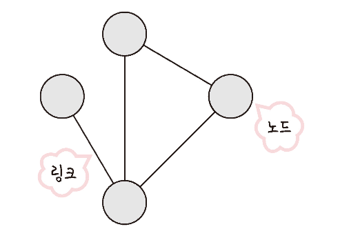
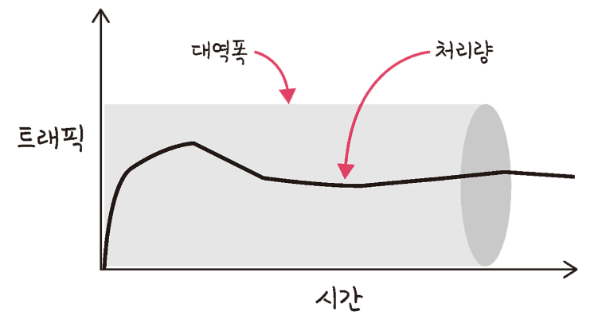
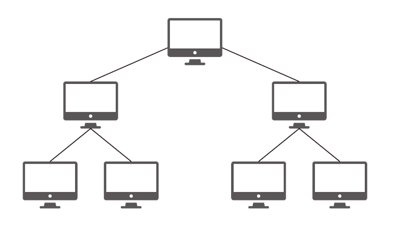
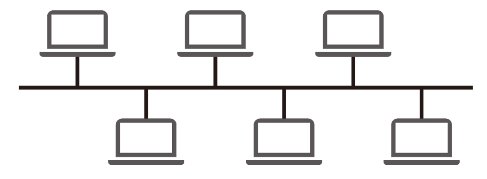
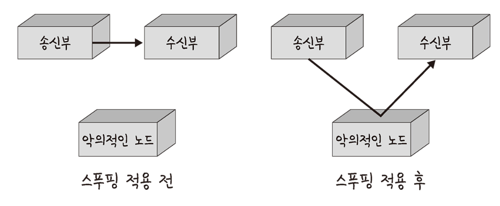
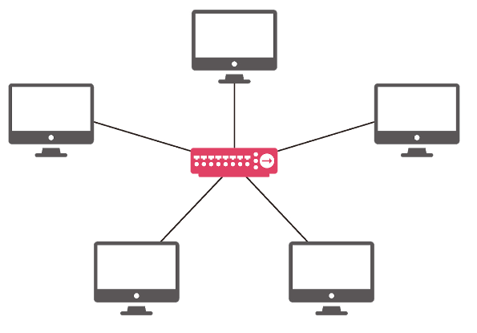
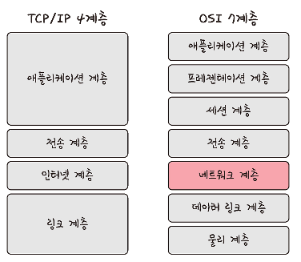
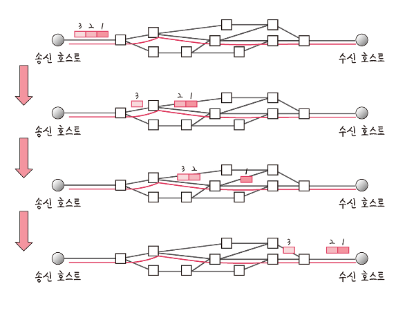
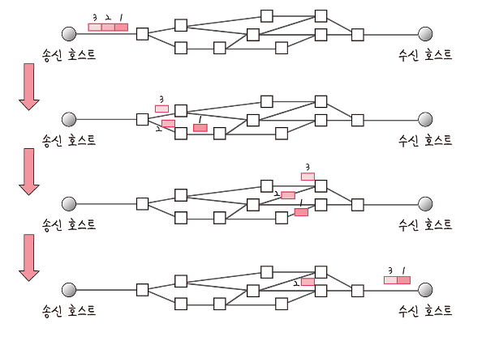
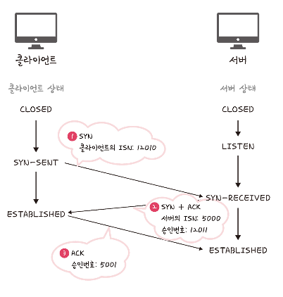

## 2.1. 네트워크 기초

### 2.1.1. Concept

- 네트워크란 노드(node)와 링크(link)가 서로 연결되어 있거나 연결되어 있지 않은 집합체를 의미한다.

- 여기서 <mark>**노드**란 서버, 라우터, 스위치 등 네트워크 장치</mark>를 의미하고 
- **링크**는 유선  또는 무선을 의미한다.

- 처리량(throughput)이란 링크를 통해 전달되는 단위 시간당 데이터양을 말합니다. 단위로는 bps(bits per second)를 씁니다. 초당 전송 또는 수신되는 비트 수라는 의미이다.
- 처리량은 사용자들이 많이 접속할 때마다 커지는 트래픽, 네트워크 장치 간의 **대역폭**(주어진 시간 동안 네트워크 연결을 통해 흐를 수 있는 최대 비트 수), 네트워크 중간에 발생하는 에러, 장치의 하드웨어 스펙에 영향을 받는다.

- 지연 시간(latency)이란 요청이 처리되는 시간을 말하며 어떤 메시지가 두 장치 사이를 왕복하는 데 걸린 시간을 말한다. 유무선 여부, 패킷 크기, 라우터의 패킷 처리 시간에 영향을 받는다.

### 2.1.2. 네트워크 토폴로지와 병목 현상

- 트리 토폴로지란 트리형태의 계층적 네트워크 구성을 의미한다. 노드의 추가, 삭제가 쉬우며, 특정 노드에 트래픽이 집중될 때 하위 노드에 영향을 끼칠 수 있다.

- 버스 토폴로지란 중앙 통신 회선 하나에 여러 노트가 연결되어 공유하는 네트워크 구성을 의미한다. 근거리 통신망(LAN)에서 사용한다. 단점으로는 수푸핑에 취약하다는 것이다.

> **스푸핑**
>
> 
>
> - 스푸핑이란 LAN 상에서 스위칭 기능을 마비시키거나 속여서 특정 노드를 악의적인 노드로 오도록 하는 것을 의미한다.
> - 위의 그림처럼 스푸핑이 적용되면, 올바르게 수신부로 가야 할 패킷이 악의적인 노드로 전달된다.

- 스타 토폴로지란 중앙에 있는 노드에 모두 연결된 네트워크 구성을 의미한다.

- 노드를 추가하거나 에러를 탐지하기 쉽고, 패킷의 충돌 발생 가능성이 적다. 또한 어떠한 노드에 장애가 발생해도 쉽게 에러를 발견할 수 있으며 장애 노드가 중앙 노드가 아닐 경우 다른 노드에 영향을 끼치는 것이 적다. 하지만 중앙노드에 장애가 발생하면 전체 네트워크를 사용할 수 없게 되고, 설치 비용 자체가 비싼편이다.

- 링형 토폴로지는 각각의 노드가 양옆의 두 노드와 연결하여 고리형태를 만드는 구조이다. 노드 수가 증가되어도 네트워크 상의 손실이 거의 없고, 충돌이 발생되는 가능성이 적고, 노드의 고장을 쉽게 찾을 수 있다. 하지만 네트워크 구성 변경이 어렵고, 회선에 장애가 발생하면 전체 네트워크에 영향을 크게 끼칠 수 있다.

- 메시 토폴로지는 망형 토폴로지라고도 하며, 그물망처럼 연결된 구조이다.
- 한 단말 장치에 장애가 발생한다 해도, 여러 개의 경로가 존재하기 때문에 네트워크를 계속 사용할 수 있다. 트래픽의 분산 처리가 가능하다. 하지만 노드의 추가가 어렵고, 구축 비용과 운용 비용이 고가다.

### 병목 현상과 토폴로지

- 네트워크 토폴로지는 병목현상을 찾을 때 중요한 기준이 된다. 

### 네트워크의 분류

- LAN : 근거리 통신 망, 건물이나 캠퍼 등 좁은 공간에서 운영됨.
- MAN 대도시 지역 네트워크를 의미
- WAN 광역 네트워크 국가 또는 대륙 같은 더 넓은 지역에서 운영

### 네트워크 성능 분석 명령어들

`ping`

- ping(Packet Internet Groper)은 네트워크 상태를 확인하려는 대상 노드를 향해 **일저 크기의 패킷**을 전송하는 명령어이다. 이를 통해 행당 노드의 패킷 수신 상태, 도달 시간 등을 알 수 있다.

`netstat`

- `netstat` 명령어는 현재 접속되어 있는 서비스들의 네트워크 상태를 표시한다.

- 네트워크 접속, 라우팅 테이블, 네트워크 프로토콜 등을 보여준다.

`nslookup`

- `nslookup`은 DND에 관련된 내용을 확인하기 위해 쓰는 명령어이다. 특정 도메인에 매핑된 IP를 확인한다.

`tracert`

- 리눅스에서는 `traceroute`라는 명령어로 구동된다.

- 목적지 노드까지의 네트워크 경로를 확인한다.

### 네트워크 프로토콜 표준화

네트워크 프로토콜이란 다른 장치들끼리 데이터를 주고받기 위해 설정된 공통된 인터페이스를 의미한다.

## 2.2. TCP/IP 4계층 모델

- 인터넷 프로토콜 스위트는 인터넷에서 컴퓨터들이 서로 정보를 주고받는데 쓰이는 프로토콜의 집합이다.
- 이를 TCP/IP 4계층 모델로 설명하거나 OSI 7계층 모델로 설명한다.

### 2.2.1. 애플리케이션 계층

- 애플리케이션 계층은 FTP, HTTP, SSH, SMTP, DND 등 응용프로그램이 사용되는 프로토콜 계층이다.
- 웹서비스 이메일 등 서비스를 실질적으로 사람들에게 제공하는 층이다.

### 2.2.2. 전송 계층

- 전송 계층은 송신자와 수신자를 연결하는 통신 서비스를 제공한다.
- 대표적으로 TCP와 UDP가 있다.
- TCP는 패킷 사이의 **순서를 보장**하고 연결 지향 프로토콜을 사용해서 연결한다.
- UDP는 **순서를 보장하지 않고 수신 여부를 확인하지 않으며** 단순히 데이터만 주는 데이터그램 패킷 교환방식이다.

**가상 회선 패킷 교환 방식**

- 가상 회선 패킷 교환 방식은 각 패킷에는 **가상회선 식별자**가 포함되며, 모든 패킷을 전송하면, 가상회선이 해제되고, 패킷들은 전송된 순서대로 도착하는 방식을 말한다.
- 위의 그림에서 3, 2, 1로 이루어진 패킷이 어떠한 회선을 따라 **순서대로** 도착하는 것을 알수 있다.

**데이터그램 패킷 교환 방식**

- 데이터그램 패킷 교환 방식이란 패킷이 독립적으로 이동하며, 최적의 경로를 선택하여 가는데, 하나의 메시지에서 분할된 여러 패킷은 서로 다른 경로로 전송될 수 있으며, 도착한 순서가 다를 수 있는 방식을 뜻한다.

- 위의 그림에서 3,2,1로 구성된 패킷이 어떠한 회선을 중심으로 가는 것이 아니라 따로따로 이동하며 순서도 다르게 도착하는 것을 알 수 있다.

**TCP 연결 성립 과정**

- TCP는 신뢰성을 확보할 때 **3-웨이 핸드 셰이크**라는 작업을 진행한다.

- 위의 그림처럼 클라이언트와 서버가 통신할 때 다음과 같은 세 단계의 과정을 거치게 된다.
  - SYN 단계 : 클라이언트는 서버에 클라이언트의 ISN을 담아 SYN을 보낸다. ISN은 새로운 TCP 연결의 첫번째 패킷에 할당된 임의의 시퀀스 번호를 말한다. 이는 장치마다 다를 수 있다.
  - SYN + ACK 단계 : 서버는 클라이언트의 SYN을 수신하고, 서버의 ISN을 보내며, 승인번호로 클라이언트의 ISN + 1을 보낸다.
  - ACK 단계 : 클라이언트는 서버의 ISN + 1 한 값인 승인번호를 담아 ACK를 서버에 보낸다.
- 이렇게 3-웨이 핸드셰이크 과정 이후 신뢰성이 구축되고 데이터 전송을 시작한다. 참고로 TCP는 이 과정이 있기 때문에 신뢰성이 있는 계층이라고 하며, UDP는 이 과정이 없기 때문에 신뢰성이 없는 계층이라고 한다.

### 2.2.3. 인터넷 계층

- 인터넷 계층은 장치로부터 받은 네트워크 패킷을 IP 주소로 지정된 목적지로 전송하기 위해 사용되는 계층이다. 
- IP, ARP, ICMP등이 있으며 패킷을 수신해야 할 상대의 주소를 지정하여 데이터를 전달한다.
- 상대방이 제대로 받았는지에 대해 **보장하지 않는** 비연결적인 특징을 가지고 있다.

### 2.2.4. 링크 계층

- 링크 계층은 전선, 광섬유, 무선 등으로 실질적으로 데이터를 전달하며 장치 간에 신호를 주고받는 **규칙을 정하는 계층**이다. 

