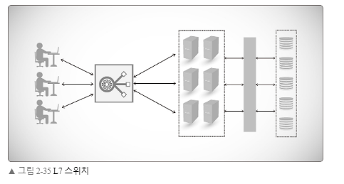
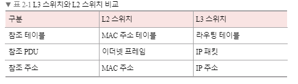
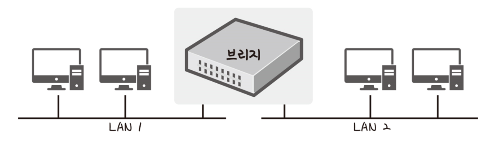
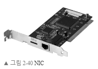
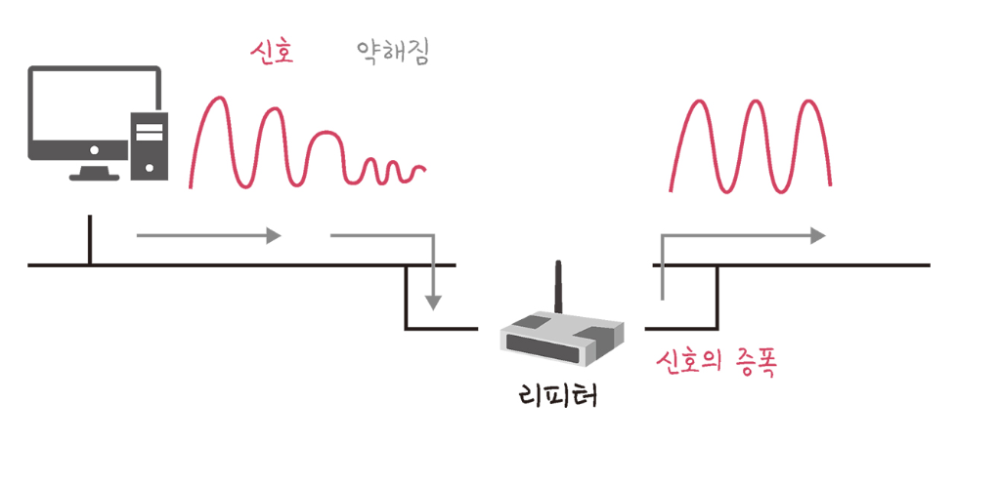
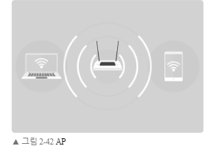
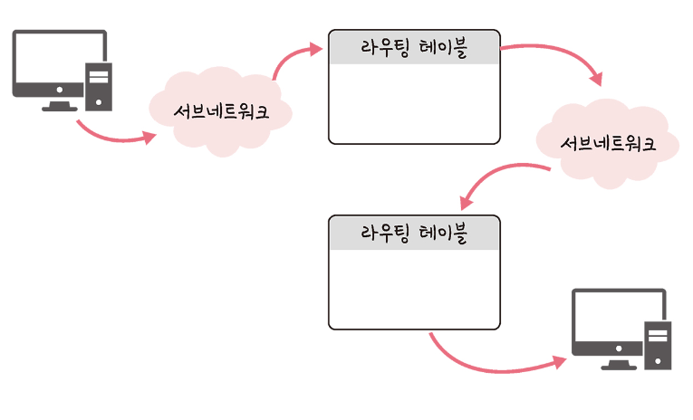
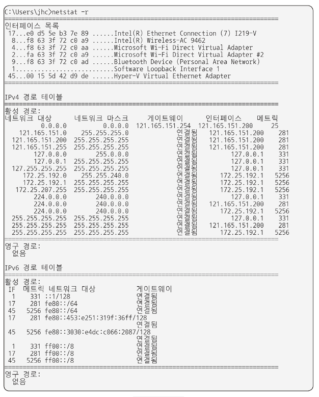
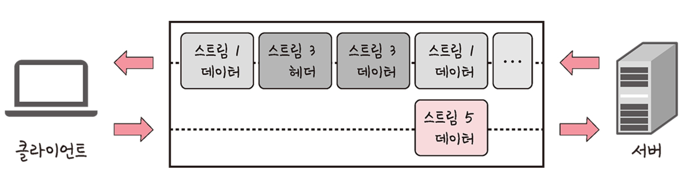

## 2.1. 네트워크 기초

### 2.1.1. Concept

- 네트워크란 노드(node)와 링크(link)가 서로 연결되어 있거나 연결되어 있지 않은 집합체를 의미한다.

- 여기서 <mark>**노드**란 서버, 라우터, 스위치 등 네트워크 장치</mark>를 의미하고 
- **링크**는 유선  또는 무선을 의미한다.

- 처리량(throughput)이란 링크를 통해 전달되는 단위 시간당 데이터양을 말합니다. 단위로는 bps(bits per second)를 씁니다. 초당 전송 또는 수신되는 비트 수라는 의미이다.
- 처리량은 사용자들이 많이 접속할 때마다 커지는 트래픽, 네트워크 장치 간의 **대역폭**(주어진 시간 동안 네트워크 연결을 통해 흐를 수 있는 최대 비트 수), 네트워크 중간에 발생하는 에러, 장치의 하드웨어 스펙에 영향을 받는다.

- 지연 시간(latency)이란 요청이 처리되는 시간을 말하며 어떤 메시지가 두 장치 사이를 왕복하는 데 걸린 시간을 말한다. 유무선 여부, 패킷 크기, 라우터의 패킷 처리 시간에 영향을 받는다.

### 2.1.2. 네트워크 토폴로지와 병목 현상

- 트리 토폴로지란 트리형태의 계층적 네트워크 구성을 의미한다. 노드의 추가, 삭제가 쉬우며, 특정 노드에 트래픽이 집중될 때 하위 노드에 영향을 끼칠 수 있다.

- 버스 토폴로지란 중앙 통신 회선 하나에 여러 노트가 연결되어 공유하는 네트워크 구성을 의미한다. 근거리 통신망(LAN)에서 사용한다. 단점으로는 수푸핑에 취약하다는 것이다.

> **스푸핑**
>
> 
>
> - 스푸핑이란 LAN 상에서 스위칭 기능을 마비시키거나 속여서 특정 노드를 악의적인 노드로 오도록 하는 것을 의미한다.
> - 위의 그림처럼 스푸핑이 적용되면, 올바르게 수신부로 가야 할 패킷이 악의적인 노드로 전달된다.

- 스타 토폴로지란 중앙에 있는 노드에 모두 연결된 네트워크 구성을 의미한다.

- 노드를 추가하거나 에러를 탐지하기 쉽고, 패킷의 충돌 발생 가능성이 적다. 또한 어떠한 노드에 장애가 발생해도 쉽게 에러를 발견할 수 있으며 장애 노드가 중앙 노드가 아닐 경우 다른 노드에 영향을 끼치는 것이 적다. 하지만 중앙노드에 장애가 발생하면 전체 네트워크를 사용할 수 없게 되고, 설치 비용 자체가 비싼편이다.

- 링형 토폴로지는 각각의 노드가 양옆의 두 노드와 연결하여 고리형태를 만드는 구조이다. 노드 수가 증가되어도 네트워크 상의 손실이 거의 없고, 충돌이 발생되는 가능성이 적고, 노드의 고장을 쉽게 찾을 수 있다. 하지만 네트워크 구성 변경이 어렵고, 회선에 장애가 발생하면 전체 네트워크에 영향을 크게 끼칠 수 있다.

- 메시 토폴로지는 망형 토폴로지라고도 하며, 그물망처럼 연결된 구조이다.
- 한 단말 장치에 장애가 발생한다 해도, 여러 개의 경로가 존재하기 때문에 네트워크를 계속 사용할 수 있다. 트래픽의 분산 처리가 가능하다. 하지만 노드의 추가가 어렵고, 구축 비용과 운용 비용이 고가다.

### 병목 현상과 토폴로지

- 네트워크 토폴로지는 병목현상을 찾을 때 중요한 기준이 된다. 

### 네트워크의 분류

- LAN : 근거리 통신 망, 건물이나 캠퍼 등 좁은 공간에서 운영됨.
- MAN 대도시 지역 네트워크를 의미
- WAN 광역 네트워크 국가 또는 대륙 같은 더 넓은 지역에서 운영

### 네트워크 성능 분석 명령어들

`ping`

- ping(Packet Internet Groper)은 네트워크 상태를 확인하려는 대상 노드를 향해 **일저 크기의 패킷**을 전송하는 명령어이다. 이를 통해 행당 노드의 패킷 수신 상태, 도달 시간 등을 알 수 있다.

`netstat`

- `netstat` 명령어는 현재 접속되어 있는 서비스들의 네트워크 상태를 표시한다.

- 네트워크 접속, 라우팅 테이블, 네트워크 프로토콜 등을 보여준다.

`nslookup`

- `nslookup`은 DND에 관련된 내용을 확인하기 위해 쓰는 명령어이다. 특정 도메인에 매핑된 IP를 확인한다.

`tracert`

- 리눅스에서는 `traceroute`라는 명령어로 구동된다.

- 목적지 노드까지의 네트워크 경로를 확인한다.

### 네트워크 프로토콜 표준화

네트워크 프로토콜이란 다른 장치들끼리 데이터를 주고받기 위해 설정된 공통된 인터페이스를 의미한다.

## 2.2. TCP/IP 4계층 모델

- 인터넷 프로토콜 스위트는 인터넷에서 컴퓨터들이 서로 정보를 주고받는데 쓰이는 프로토콜의 집합이다.
- 이를 TCP/IP 4계층 모델로 설명하거나 OSI 7계층 모델로 설명한다.

### 애플리케이션 계층

- 애플리케이션 계층은 FTP, HTTP, SSH, SMTP, DND 등 응용프로그램이 사용되는 프로토콜 계층이다.
- 웹서비스 이메일 등 서비스를 실질적으로 사람들에게 제공하는 층이다.

### 전송계층

- 전송 계층은 송신자와 수신자를 연결하는 통신 서비스를 제공한다.
- 대표적으로 TCP와 UDP가 있다.
- TCP는 패킷 사이의 순서를 보장하고 연결 지향 프로토콜을 사용해서 연결한다.
- UDP는 순서를 보장하지 않고 수신 여부를 확인하지 않으며 단순히 데이터만 주는 데이터그램 패킷 교환방식이다.

### 인터넷 계층

- 인터넷 계층은 장치로부터 받은 네트워크 패킷을 IP 주소로 지정된 목적지로 전송하기 위해 사용되는 계층이다. 
- IP, ARP, ICMP등이 있으며 패킷을 수신해야 할 상대의 주소를 지정하여 데이터를 전달한다.
- 상대방이 제대로 받았는지에 대해 보장하지 않는 비연결적인 특징을 가지고 있다.

#### 링크 계층

- 링크 계층은 전선, 광섬유, 무선 등으로 실질적으로 데이터를 전달하며 장치 간에 신호를 주고받는 규칙을 정하는 계층이다. 

## 2.3. 네트워크 기기

- 네트워크 기기는 계층별로 처리 범위가 나뉘어 진다.

- **물리 계층**을 처리할 수 있는 기기와 **데이터 링크 계층**을 처리할 수 있는 기기 등이 있다. 그리고 상위 계층을 처리하는 기기는 하위 계층을 처리할 수 있지만 그 반대는 불가능 하다. 예를 들어 L7 스위치는 애플리케이션 계층을 처리하는 기기로 그 밑의 모든 계층의 프로토콜을 처리할 수 있다. 하지만 AP는 물리 계층밖에 처리하지 못한다.
  - 애플리케이션 계층 : L7 스위치
  - 인터넷 계층 : 라우터, L3 스위치
  - 데이터 링크 계층 : L2 스위치, 브리지
  - 물리계층: NIC, 리피터, AP

### L7 스위치(L7 로드밸런서)

- 스위치는 여러 장비를 연결하고, 데이터 통신을 중재하며, 목적지가 연결된 포트로만 전기 신호를 보내 데이터를 전송하는 통신 네트워크 장비이다.
- L7 스위치는 서버의 부하를 분산하는 기기이다. 클라이언트로부터 오는 요청들을 뒤쪽의 여러 서버로 나누는 역할을 하며, 시스템이 처리할 수 있는 트래픽 증가를 목표로 한다.
- URL, 서버, 캐시, 쿠키들을 기반으로 트래픽을 분산한다.
- 또한 바이러스, 불필요한 외부 데이터 등을 걸러내는 필터링 기능 또한 가지고 있으며, 응용 프로그램 수준의 트래픽 모니터링도 가능하다.
- 만약 장애가 발생한 서버가 있다면 이를 트래픽 분산 대상에서 제외해야 할 것이다. 이는 정기적인 **헬스 체크**를 이용하여 감시하면서 이루어 진다.

### L4 스위치와 L7 스위치의 차이

- 로드밸런서로는 L7 스위치 뿐만 아니라, L4 스위치도 있다. 
- L4 스위치는 인터터넷 계층을 처리하는 기기로 스트리밍 관련 서비스에서는 사용할 수 없으며, 메시지를 기반으로 인식하지 못하고, IP와 포트를 기반으로 트래픽을 분산한다.
- 반면 L7 로드밸런서는 IP, 포트 외에도 URL, HTTP 헤더, 쿠키 등을 기반으로 트래픽을 분산한다.
- 참고로 클라우드 서비스(AWS 등)에서 L7 스위치를 이용한 로드밸런싱은 ALB (Application Load Balancer) 컴포넌트로 하며, L4 스위치를 이용한 로드밸런싱은 NLB (Network Load Balancer) 컴포넌트로 한다.

### 헬스 체크

- L4 스위치 또는 L7 스위치 모두 헬스 체크를 통해 정상적인 서버 또는 비정상적인 서버를 판별한다.
- 헬스 체크는 전송 주기와 재전송 회수 등을 설정한 이후 반복적으로 서버에 요청을 보내는 것을 말한다.
- 이 때 서버에 부하가 되지 않도록 요청 횟수를 조절해야 한다.
- TCP, HTTP 등 다양한 방법으로 요청을 보내며, 이 요청이 정상적으로 이루어 졌다면 정상적인 서버로 판별한다.
- 예를 들어 TCP 요청을 보냈는데 3-웨이 핸드 셰이크가 정상적으로 일어나지 않았다면 정상이 아닌 것으로 판별할 수 있을 것이다.

### 로드 밸런서를 이용한 서버 이중화

- 로드 밸런서는 대표적인 기능으로 **서버 이중화**를 들 수 있다. 서비스를 안정적으로 운용하기 위해서는 2대 이상의 서버는 필수적이다. 왜냐하면 서버 하나가 죽더라도 다른 서버로 서비스를 이어갈 수 있기 때문이다. 로드 밸런스는 2대 이상의 서버를 기반으로 가상 IP를 제공하고 이를 기반으로 안정적인 서비스를 제공한다. 

- 위의 그림처럼 로드밸런스가 제공한 `0.0.0.12010`이란 가상 IP에 사용자들이 접근하고 뒷단에 사용 가능한 서버인 `0.0.0.12011`과 `0.0.0.12012`를 기반으로 서빙한다면, `0.0.0.12011`이란 서버에 장애가 발생해도, `0.0.0.12012` 서버를 통해 서비스를 이어갈 수 있다.

### 인터넷 계층을 처리하는 기기: 라우터

- 라우터는 여러 개의 네트워크를 연결, 분할, 구분시켜주는 역할을 한다.
- 다른 네트워크에 존재하는 장치끼리 서로 데이터를 주고받을 때 패킷 소모를 최소화하고, 경로를 최적화하여, 최소 경로로 패킷을 포워딩하는 장비이다.

### 인터넷 계층을 처리하는 기기: L3 스위치

- L3 스위치란 **L2 스위치의 기능과 라우팅 기능을 갖춘 장비**를 말한다.
- L3 스위치를 라우터라고 해도 무방하다.
- 라우터는 소프퉤어 기반의 라우팅과 하드웨어 기반의 라우팅으로 나뉘는데, 하드웨어기반의 라우팅을 담당하는 장치를 L3 스위치라고 한다.

### 데이터 링크 계층을 처리하는 기기

#### L2 스위치

- L2 스위치는 장비들의 MAC 주소를 MAC 주소 테이블을 통해 관리하며, 연결된 장치로부터 패킷이 왔을 때 패킷 전송을 담당한다.
- IP 주소를 이해하지 못한다. 
- 따라서 IP 주소 기반의 라우팅은 불가하다.
- 단순히 패킷의 MAC 주소를 읽어 스위칭 하는 역할을 한다.
- 목적지가 MAC 주소 테이블에 없다면 전체 포트에 전달하고, MAC 주소 테이블의 주소는 일정 시간 이후 삭제하는 기능도 있다.

### 브릿지

- 브릿지는 두개의 근거리 통신망을 상호 접속할 수 있도록 하는 통신망 연결 장치이다.
- 포트와 포트 사이의 다리 역할을 한다. 장치에서 받아온 MAC 주소를 MAC 주소 테이블로 관리한다.

### 물리계층을 처리하는 기기

#### NIC

LAN 카드라고 하는 네트워크 인터페이스 카드(NIC)는 2대 이상의 컴퓨터 네트워크를 구성하는 데 사용하며, 네트워크와 빠른 속도로 데이터를 송수신할 수 있도록 컴퓨터 내에 설치하는 확장 카드이다.

각 LAN 카드에는 주민등록번호처럼 각각을 구분하기 위한 고유의 식별번호인 MAC 주소가 있다.

#### 리피터

- 리피터(repeater)는 들어오는 약해진 신호 정도를 증폭하여 다른 쪽으로 전달하는 장치를 말한다.

- 이를 통해 패킷이 더 멀리 전달될 수 있으나, 광케이블이 보급된 현재는 잘 쓰이지 않는 장치다.

#### AP

AP(Access Point)는 패킷을 복사하는 기기이다. AP에 유선 LAN을 연결한 후 다른 장치에서 무선 LAN 기술 (와이파이 등)을 사용하여 무선 네트워크 연결을 할 수 있다.

## 2.4. IP 주소

### 2.4.1. ARP

> 컴퓨터와 컴퓨터는 IP주소에서 ARP를 통해 MAC 주소를 찾아 MAC 주소를 기반으로 통신한다.

- ARP(Address Resolution Protocol)란 IP 주소로부터 MAC 주소를 구하는 IP주소와 MAC 주소의 다리 역할을 하는 프로토콜이다.

- **ARP**를 통해 **가상 주소**인 **IP 주소**를 실제 주소인 **MAC 주소**로 변환한다. 

- 이와 반대로 RARP를 통해 실제 주소인 MAC 주소를 가상 주소인 IP 주소로 변환하기도 한다.

- 위의 그림처럼 장치 A가 ARP Request 브로드캐스트를 보내서 IP 주소인 120.70.80.3에 해당하는 MAC 주소를 찾는다. 
- 그러고 나서 해당 주소에 맞는 장치 B가 ARP reply 유니캐스트를 통해 MAC 주소를 반환하는 과정을 거쳐 IP 주소에 맞는 MAC주소를 찾게 된다.

> 브로드 캐스트  : 송신 호스트로부터 전송된 데이터가 네트워크에 연결된 모든 호스트에 전송되는 방식
>
> 유니캐스트 : 고유 주소로 식별된 하나의 네트워크 목적지에 1:1로 데이터를 전송하는 방식

### 2.4.2. 홉바이홉 통신

- IP 주소를 통해 통신하는 과정을 홉바이홉(hop by hop) 통신이라고 한다.
- 여기서 홉(hop)이란 영어 뜻 자체로는 건너뛰는 모습을 의미한다. 이는 통신망에서 각 패킷이 여러 개의 라우터를 건너가는 모습을 비유적으로 표현한 것이다.
- 각 라우터에 있는 라우팅 테이블의 IP를 기반으로 패킷을 전달하고 다시 전달해나간다.

- 즉 통신 장치에 있는 라우팅 테이블의 IP를 통해 시작 주소부터 시작하여 다음 IP로 계속해서 이동하는 라우팅 과정을 거쳐 패킷이 최종 목적지까지 도달하는 통신을 말한다.

  

> 라우팅 : IP 주소를 찾아가는 과정

#### 라우팅 테이블

- 라우팅 테이블은 송신지에서 수신지까지 도달하기 위해 사용되며, 라우터에 들어가 있는 목적지 정보들과 그 목적지로 가기 위한 방법이 들어 있는 리스트를 뜻한다.

- 라우팅 테이블에는 게이트웨이와 모든 목적지에 대해 해당 목적지에 도달하기 위해 거쳐야 할 다음 라우터의 정보를 가지고 있다.

#### 게이트 웨이

게이트 웨이는 서로 다른 통신망 프로토콜을 사용하는 네트워크 간의 통신을 가능하게 하는 관문 역할을 하는 컴퓨터나 소프트웨어를 일컫는 용어디ㅏ.

사용자는 인터넷에 접속하기 위해 수많은 톨게이트인 게이트웨이를 거쳐야 한다.

게이트웨이는 서로 다른 네트워크상의 통신 프로토콜을 변환해주는 역할을 하기도 한다.

게이트웨이는 라우팅 테이블을 통해 조회할 수 있다.

라우팅 테이블은 터미널에서 `netstat -r` 명령어를 통해 조회할 수 있다.

앞의 그림과 같이 IPv4 경로 테이블, IPv6 경로 테이블이 있는데, 이것이 바로 라우팅 테이블이다.

게이트웨이, 인터페이스 등이 나오는 것을 볼 수 있다.

#### IP 주소 체계

- IPv4와 IPv6로 나뉜다.
- - IPv4는 32비트를 8비트 단위로 점을 찍어 표기한다.

- IPv6는 64비트를 16비트 단위로 점을 찍어 표기한다.

#### 클래스 기반 할당 방식

- IP 주소 체계는 과거를 거쳐 발전해오고 있다.
- 처음에는 A, B, C, D, E 다섯 개의 클래스로 구분하는 클래스 기반 할당 방식(CIDR)이 사용됐다.

- 또한 네트워크의 첫번째 주소는 **네트워크 주소**로 사용되고, 가장 마지막 주소는 브로드 캐스트용 주소로 네트워크에 속해 있는 모든 컴퓨터에 데이터를 보낼 때 사용된다.

- 예를 들어 클래스 A로 12.0.0.0 이란 네트워크를 부여받았다면, 12.0.0.1 ~ 12.255.255.254의 호스트 주소를 부여받은 것이다. 
- 이때 첫번째 주소인 12.0.0.0은 네트워크 구별 주소로 사용하면 안 되고, 가장 마지막 주소인 12.255.255.255의 경우 브로드 캐스팅용으로 남겨 두어야 한다.
- 그렇기 때문에 12.0.0.1 ~ 12.255.255.254를 컴퓨터에 부여할 수 있는 호스트 주소로 사용할 수 있다.

#### DHCP

- DHCP는 IP 주소 및 기타 통신 매개변수를 자동으로 할당하기 위한 네트워크 관리 프로토콜이다.
- 이 기술을 통해 네트워크 장치의 IP주소를 수동으로 설정할 필요 없이 인터넷에 접속할 때마다 자동으로 IP 주소를 할당할 수 있다.
- 많은 라우터와 게이트웨이 장비에 DHCP 기능이 있으며 이를 통해 대부분의 가정용 네트워크에서 IP를 할당한다.

#### NAT

- NAT(Network Address Translation)는 패킷이 라우팅 장치를 통해 전송되는 동안 패킷의 IP 주소 정보를 수정하여, IP 주소를 다른 주소로 매핑하는 방법이다.
- IPv4 주소 체계만으로 많은 주소들을 모두 감당하지 못하는 단점이 있는데 이를 해결하기 위해 NAT로 공인 IP와 사설 IP로 나눠서 많은 주소를 처리한다. 
- NAT를 가능하게 하는 소프트웨어는 ICS, RRAS, Netfilter 등이 있다.

- 앞의 그림처럼 홍철 팀장, 가영 대리는 192.168.0.xxx 를 기반으로 각기 다른 IP를 가지고 있다. 이를 사설 IP라고 한다.
- 그리고 NAT 장치를 통해 하나의 공인 IP인 121.165.151.200으로 외부 인터넷에 요청할 수 있다.

## 2.5. HTTP

### 2.5.1. HTTP/1.0

HTTP/1.0은 기본적으로 한 연결당 하나의 요청을 처리하도록 설계되었다. 이는 RTT 증가를 야기했다.

> RTT : 패킷이 목적지에 도달하고 나서 다시 출발지로 돌아오기까지 거릴는 시간을 의미한다.

### 2.5.2. HTTP/1.1.

매번 TCP 연결을 하는 것이 아니라, 한 번 TCP 초기화를 한 이후 keep-alive라는 옵션으로 여러개의 파일을 송수신할 수 있게 바꾼 구조이다.

#### HOL Blocking

HOL Blocking은 네트워크에서 같은 큐에 있는 패킷이 그 첫번째 패킷에 의해 지연될 때 발생하는 성능 저하를 의미한다.

예를 들어 위의 그림처럼 image.jpg와 style.css, data.xml을 다운로드 받을 때 보통은 순차적으로 잘 받아지지만, image.jpg가 느리게 받아진다면 그 위에 있는 것들이 대기하게 되며 다운로드가 지연되는 상태가 될 수 있다.

### 2.5.3. HTTP/2

HTTP/2는 SPDY 프로토콜에서 파생된 HTTP/1.x보다 지연 시간을 줄이고, 응답 시간을 더 빠르게 한 멀티플렉싱, 헤더 압축, 서버 푸시, 요청의 우선순위 처리를 지원하는 프로토콜이다.

#### 멀티플렉싱

멀티플렉싱이란 여러 개의 스트림을 사용하여 송수신한다는 것이다. 이를 통해 특정 스트림의 패킷이 손실되어도 해당 스트림에만 영향을 미치고 나머지 스트림은 멀쩡하게 동작할 수 있다.

- 위의 그림은 하나의 연결 내 여러 스트림을 캡처한 모습이다.
- 병렬적인 스트림들을 통해 데이터를 서빙하고 있다. 
- 또한 스트림 내의 데이터들도 쪼개져 있다.
- 애플리케이션에서 받아온 메시지를 독립된 프레임으로 조각내어 서로 송수신한 이후 다시 조립하여 데이터를 주고 받고 있다.

- 이를 통해 단일 연결을 사용하여 병렬로 여러 요청을 받을 수 있고, 응답을 줄 수 있다.
- 이를 통해 HOL Blocking을 해결할 수 있다.

#### 헤더 압축

HTTP/1.x에는 크기가 큰 헤더라는 문제가 있었다. 이를 HTTP/2에서는 허프만 코딩 압축 알고리즘을 사용하는 HPACK 압축을 통해 해결한다.

#### HTTPS

HTTP/2는 HTTPS 위에서 동작한다. HTTPS는 어플리케이션 계층과 전송 계층 사이에 신뢰 계층인 SSL/TLS 계층을 넣은 신뢰할 수 있는 HTTP 요청을 말한다.

