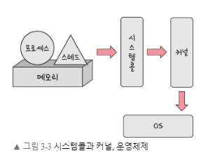
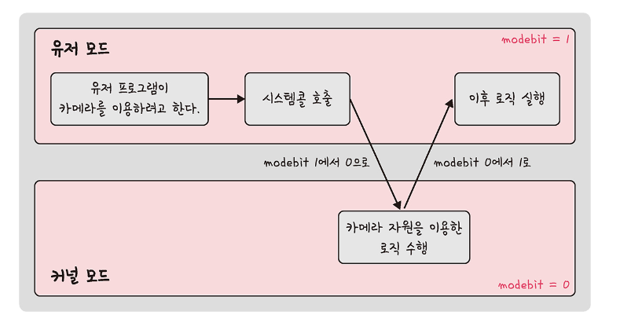
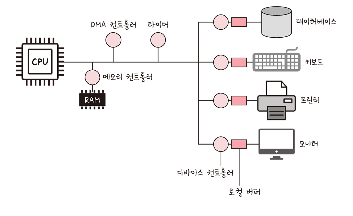
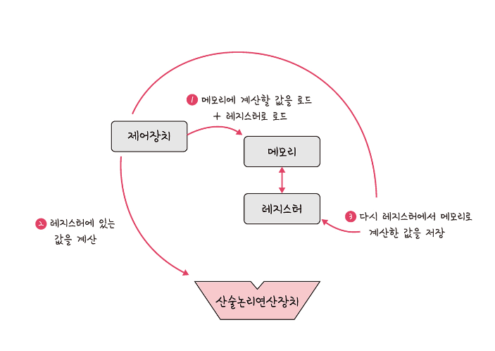
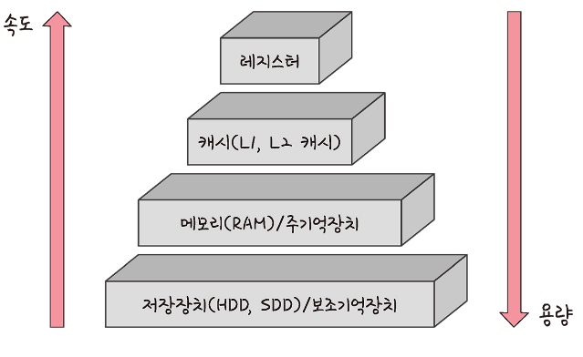
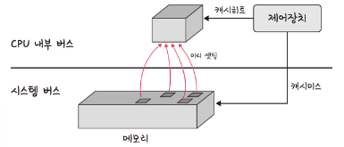
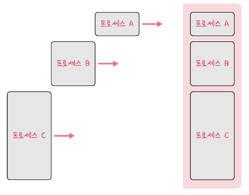
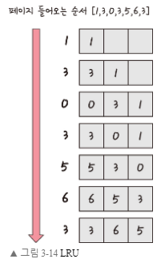
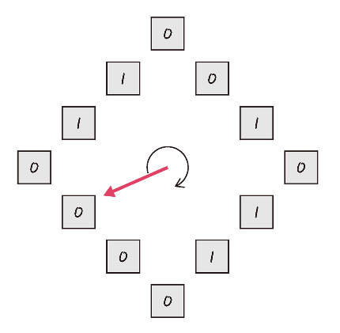

# 3.1. 운영체제와 컴퓨터

## 3.1.1. 운영체제의 역할과 구조

### 운영체제의 역할

1. CPU 스케쥴링과 프로세스 관리 : CPU 소유권을 어떤 프로세스에 할당할지, 프로세스의 생성과 삭제, 지원 할당 및 반환을 관리한다.
2. 메모리 관리 : 한정된 메모리를 어떤 프로세스에 얼마큼 할당해야 하는지 관리한다.
3. 디스크 파일 관리 : 디스크 파일을 어떠한 방법으로 보관할지 관리한다.
4. I/O 디바이스 관리 : I/O 디바이스들인 마우스, 키보드와 컴퓨터 간에 데이터를 주고받는 것을 관리한다.


- 운영체제는 유저 프로그램과 하드웨어를 연결한다.
- 


### 시스템콜

- 시스템콜이란 운영체제가 커널에 접근하기 위한 인터페이스이며, 유저 프로그램이 운영체제의 서비스를 받기 위해 커널 함수를 호출할 때 사용한다.
- 유저 프로그램이 I/O 요청으로 트랩(trap)을 발동하면 올바른 I/O 요청인지 확인한 후 유저 모드가 시스템콜을 통해 커널 모드로 변환되어 실행된다. 
- 예를 들어 I/O 요청에 해당되는 `fs.readFile()`이라는 파일 시스템의 파일을 읽는 함수가 발동했다고 해보자, 이 때 유저 모드에서 파일을 읽지 않고 커널 모드로 들어가 파일을 읽고 다시 유저 모드로 돌아가 그 뒤에 있는 유저 프로그램의 로직을 수행한다. 이 과정을 통해 컴퓨터 자원에 대한 직접 접근을 차단할 수 있고, 프로그램을 다른 프로그램으로부터 보호할 수 있다.


> 드라이버란 하드웨어를 제어하기 위한 소프트웨어를 의미한다.
>
> I/O 요청이란 입출력 함수, 데이터베이스, 네트워크, 파일 접근 등에 관한 일을 의미한다.




- 프로세스나 스레드에서 운영체제로 어떠한 요청을 할 때 시스템콜이라는 인터페이스와 커널을 거쳐 운영체제에 전달된다.


### modebit

- 시스템콜이 작동될 때 `modebit`을 참고해서 유저 모드와 커널 모드를 구분한다.
- `modebit`은 `1`또는 `0`의 값을 가지는 플래그 변수이다.



- 카메라, 키보드 등 I/O 디바이스는 운영체제를 통해서만 작동해야 한다.


### 3.1.2. 컴퓨터의 요소

- 컴퓨터는 CPU, DMA 컨트롤러, 메모리, 타이머, 디바이스 컨트롤러 등으로 이루어져 있다.



### CPU

- CPU(Central Processing Unit)는 산술논리연산장치, 제어장치, 레지스터로 구성된다.
- 메모리의 명령어를 해석해서 실행한다.

- 제어장치란 프로세스 조작을 지시하는 CPU의 한 부품이다. I/O device들 간의 통신을 제어하고 명령어들을 읽고 해석하며 데이터 처리를 위한 순서를 결정한다.

- 레지스터란, CPU 안에 있는 매우 빠른 임시기억장치이다. CPU와 직접 연결되어 연산 속도가 메모리보다 수십배에서 수백배까지 바르다. CPU는 자체적으로 데이터를 저장할 방법이 없기 때문에 레지스터를 거쳐 데이터를 전달한다.
- 산술논리연산장치(ALU, Arithmetic Logic Unit)는 덧셈, 뺄셈 같은 두 숫자의 산술 연산과 배타적 논리합, 논리곱 같은 논리 연산을 계산하는 디지털 회로이다.




- CPU에서 제어장치, 레지스터, 산술논리연산장치를 통해 연산하는과정은 다음과 같다.
  1. 제어장치가 메모리에 계산할 값을 로드한다. 또한 레지스터에도 로드한다.
  2. 제어장치가 레지스터에 있는 값을 계산하라고 산술논리연산장치에 명령한다.
  3. 제어장치가 계산된 값을 다시 레지스터에서 메모리로 계산한 값을 저장한다.


### 인터럽트

- 인터럽트는 어떤 신호가 돌아왔을 때 CPU를 잠깐 정지시키는 것을 말한다. 키보드, 마우스 등 I/O 디바이스로 인한 인터럽트, 0으로 숫자를 나누는 산술 연산에서의 인터럽트, 프로세스 오류 등으로 발생한다.
- 인터럽트가 발생되면 인터럽트 핸들러 함수가 모여 있는 인터럽트 벡터로 가서 인터럽트 핸들러 함수가 실행된다. 인터럽트 간에는 우선순위가 있고 우선순위에 따라 실행되며 인터럽트는 하드웨어 인터럽트, 소프트웨어 인터럽트가 있다.


- 하드웨어 인터럽트는 키보드를 연결한다거나 마우스를 연결하는 일 등의 I/O 디바이스에서 발생하는 인터럽트를 말한다. 이 때 인터럽트 라인이 설계된 이후 순차적인 인터럽트 실행을 중지하고 운영체제에서 시스템콜을 요청해서 원하는 디바이스로 향해 디바이스에 있는 작은 로컬 버퍼에 접근하여 일을 수행한다.

- 소프트웨어 인터럽트는 trap이라고도 하는데, 프로세스 오류등으로 프로세스가 시스템 콜을 호출할 때 발동한다.


### DMA 컨트롤러

- DMA 컨트롤러는 I/O 디바이스가 메모리에 직접 접근할 수 잇도록하는 하드웨어 장치를 뜻한다. CPU에만 너무 많은 인터럽트 요청이 들어오기 때문에 CPU 부하를 막아주며 CPU의 일을 부담하는 보조 일꾼이라고 보면 된다. 또한 하나의 작업을 CPU와 DMA 컨트롤러가 동시에 하는 것을 방지한다.


### 메모리

- 메모리는 전자회로에서 데이터나 상태, 명령어 등을 기록하는 장치를 말하며, 보통 RAM을 일컬어 메모리라고도 한다. CPU는 계산을 담당하고, 메모리는 기억을 담당한다.
- 공장에 비유하면 CPU는 일꾼, 메모리는 작업장이며, 작업장의 사이즈가 곧 메모리사이즈이다.


### 디바이스 컨트롤러

디바이스 컨트롤러는 컴퓨터와 연결되어 있는 I/O 디바이스들의 작은 CPU를 의미한다.


# 3.2. 메모리

> CPU는 그저 메모리에 올라와 있는 프로그램의 명령어들을 실행할 뿐이다. 


## 3.2.1. 메모리 계층

- 메모리는 레지스터, 캐시, 메모리, 저장장치 순으로 계층을 구성한다.



- 레지스터 : CPU 안에 있는 작은 메모리이다. 기억용량이 가장 적은 대신 대신 속도가 가장 빠르다.
- 캐시(Cache) : L1, L2 캐시를 지칭한다. 기억 용량이 적은 대신  속도가 빠르다.
  - 캐시는 데이터를 미리 복사해놓는 임시 저장소이자, 빠른 장치와 느린 장치에서 속도 차이에 따른 병목 현상을 줄이기 위한 메모리를 말한다. 이를 통해 데이터를 접근하는 시간이 오래 걸리는 경우를 해결하고 무언가를 다시 계산하는 시간을 절약할 수 있다.
  - 실제로 메모리와 CPU 사이의 속도 차이가 너무 크기 때문에 그 중간에 레지스터 계층을 둬서 속도 차이를 해결한다. 이렇게 속도 차이를 해결하기 위해 계층과 계층 사이에 있는 계층을 캐싱 계층이라고 한다. 캐시 메모리와 보조기억장치 사이에 있는 주기억장치를 보조 기억장치의 캐싱 계층이라고 하는 것과 비슷한 이치일 것이다.

- 주기억장치 : RAM, 속도는 보통, 기억용량도 보통이다.
  - RAM은 하드디스크로부터 일정량의 데이터를 복사해서, 임시 저장하고 이를 필요할 때마다 CPU에 빠르게 전달하는 역할을 한다.
  - 게임을 실행할 때 로딩중이라는 메시지가 나오는데, 이 이유는 데이터를 RAM으로 전송하는 과정이 아직 끝나지 않았음을 의미한다.
- 보조기억장치 : HDD, SSD를 일컬으며 속도가 가장 느리고, 기억 용량이 가장 많다.


> 캐시 히트와 캐시 미스
>
> 캐시에서 원하는 데이터를 찾았다면 캐시 히트라고 하며, 해당 데이터가 캐시에 없어 주 메모리로 가서 데이터를 찾아오면 캐시미스라고 한다.
>
> 


### 웹 브라우저의 캐시

- 웹 브라우저 안에는 작은 저장소 쿠키, 로컬 스토리지, 세션 스토리지가 있다.
- 이와 같은 쿠키, 로컬 스토리지, 세션 스토리지들은 소프트웨어 캐시로 분류할 수 있다.
- 쿠키는 만료기한이 있는 Key-Value 저장소이다. 
- 로컬 스토리지는 만료기한이 없는 key-Value 저장소이다. 웹 브라우저를 닫아도 유지되고, 도메인 단위로 저장, 생성된다.
- 세션 스토리지는 만료기한이 없는 Key-value 저장소이다. 탭 단위로 세션 스토리지를 생성하며, 탭을 닫을 때 해당 데이터가 삭제된다.


## 3.2.2. 메모리 관리

- 메모리 관리 역시 운영체제의 대표적인 역할 중 하나이다.


### 가상 메모리

- 가상 메모리는 메모리 관리 기법의 하나로 컴퓨터가 실제로 이용 가능한 메모리 자원을 추상화하여 이를 사용하는 사용자들에게 매우 큰 메모리로 보이게 만드는 것을 말한다.


- 이 때 가상적으로 주어진 주소를 가상 주소(logical address)라고 하며, 실제 메모리상에 있는 주소를 실제 주소(physical address)라고 한다. 가상 주소는 메모리관리장치(MMU)에 의해 실제 주소로 변환되며, 이 덕분에 사용자는 실제 주소를 의식할 필요 없이 프로그램을 구축할 수 있게 된다.
- 가상메모리는 가상 주소와 실제 주소가 매핑되어 있고 프로세스의 주소 정보가 들어 있는 페이지 테이블로 관리된다. 이 때 속도 향상을 위해 TLB를 쓰게 된다.
- TLB는 메모리와 CPU 사이에 있는 주소 변환을 위한 캐시이다. 
- 페이지 테이블에 있는 리스트를 보관하며, CPU가 페이지 테이블까지 가지 않도록 해 속도를 향상시킬수 있는 캐시 계층이다.


### 스와핑

- 만약 가상 메모리에는 존재하지만 실제 메모리인 RAM에는 현재 없는 데이터나 코드에 접근할 경우 페이지 폴트가 발생한다.
- 이를 방지하기 위해 당장 사용하지 않는 영역을 하드디스크로 옮겨 필요할 때 다시 RAM으로 불러와 올리고, 사용하지 않으면 다시 하드디스크로 내림을 반복하여 RAM을 효과적으로 관리하는 것을 스와핑이라고 한다.


### 페이지 폴트

- 페이지 폴트(Page Fault)란 프로세스의 주소 공간에는 존재하지만 지금 이 컴퓨터의 RAM에는 없는 데이터에 접근했을 경우에 발생한다. 이 때 운영체제는 다음 과정으로 해당 데이터를 메모리로 가져와서 마치 페이지 폴트가 전혀 발생하지 않은 것처럼 프로그램이 작동하게 해준다. 페이지 폴트와 그로 인한 스와핑은 다음 과정으로 이루어 지낟.

1. CPU는 물리 메모리를 확인하여 해당 페이지가 없으면 트랩을 발생해서 운영체제에 알린다.
2. 운영체제는 CPU의 동작을 잠시 멈춘다.
3. 운영체제는 페이지 테이블을 확인하여 가상 메모리에 페이지가 존재하는지 확인하고, 없으면 프로세스를 중단하고 현재 물리 메모리에 비어 있는 프레임이 있는지를 찾는다. 물리 메모리에도 없다면 스와핑이 발동된다.
4. 비어 있는 프레임에 해당 페이지를 로드하고, 페이지 테이블을 최신화 한다.
5. 중단되었던 CPU를 다시 시작한다.

> 페이지 : 가상 메모리를 사용하는 최소 크기 단위
>
> 프레임 : 실제 메모리를 사용하는 최소 크기 단위


### 스레싱

- 스레싱(Thrashing)은 메모리의 페이지 폴트율이 높은 것을 의미하며, 이는 컴퓨터의 심각한 성능 저하를 초래한다.


- 스레딩은 메모리에 너무 많은 프로세스가 동시에 올라가게 되면 스와핑이 많이 일어나서 발생하는 것이다. 페이지 폴트가 일어나면 CPU 이용률이 낮아진다. CPU 이용률이 낮아지면 운영체제는 CPU가 한가하다고 착각하게 되고, 이로 인해 가용성을 높이기 위해 더 많은 프로세스를 메모리에 올리게 된다. 이와 같은 악순환이 반복되어 스레싱이 발생한다.

- 운영체제에서 이를 해결할 수 있는 방법은 작업 세트와 PPF가 있다.
- 작업 세트는 프로세스의 과거 사용 이력인 지역성(locality)을 통해 결정된 페이지 집합을 만들어서 미리 메모리에 로드하는 것이다. 미리 메모리에 로드하면 탐색에 드는 비용을 줄 일 수 있고, 스와핑 또한 줄일 수 있다.
- PFF(Page Fault Frequency)는 페이지 폴트 빈도를 조절하는 방법으로 상한선과 하한선을 만드는 방법이다. 만약 상한선에 도달한다면 페이지를 늘리고 하한선에 도달한다면 페이지를 줄이는 것이다.


### 메모리 할당

#### 연속 할당

- 연속 할당은 메모리에 연속적으로 공간을 할당하는 것을 말한다.



- 앞의 그림처럼 프로세스 A, 프로세스 B, 프로세스 C가 순차적으로 공간에 할당하는 것을 알 수 있다.
- 크게 고정 분할 방식과 가변분할 방식으로 분류할 수 있다.
- 고정 분할 방식은 메모리를 미리 나누어 관리하는 방식이며, 이로 인해 내부 단편화가 발생한다. 내부 단편화란 메모리를 나눈 크기보다 프로그램이 작아서 들어가지 못하는 공간이 많이 생기는 현상을 말한다.
- 가변 분할 방식(Variable Partition allocation)은 매 시점 프로그램의 크기에 맞게 동적으로 메모리를 나눠 사용하는 방식이다. 내부 단편화는 발생하지 않고 외부 단편화는 발생할 수 있다.  외부단편화란 메모리를 나눈 크기보다 프로그램이 커서 들어가지 못하는 공간이 발생하는 현상이다.


#### 불연속 할당

- 페이징은 동일한 크기의 페이지 단위로 나누어 메모리의 서로 다른 위치에 프로세스를 할당하는 기법이다. 홀의 크기가 균일하지 않는 문제가 없어지지만 주소 변환이 복잡해진다.
- 세그멘테이션은 페이지 단위가 아닌 의미 단위인 세그먼트로 나누는 방식이다. 프로세스는 코드, 데이터, 스택, 힙 등으로 이루어지는데, 코드와 데이터 등 이를 기반으로 나눌 수도 있으며 함수 단위로 나눌 수도 있음을 의미한다. 


### 페이지 교체 알고리즘

#### FIFO

먼저 온 페이지를 교체 영역에 가장 먼저 내놓는 방법


#### LRU

- 참조가 가장 오래된 페이지를 바꾸는 알고리즘이다.

- 
- 위의 그림처럼 5번 페이지가 들어왔을 때 가장 참조가 오래된 1번 페이지와 스왑되는 것을 볼 수 있는데 이것이 바로 LRU 방식이다.

#### NUR 

- LRU에서 발전한 NUR(Not Used Recently) 알고리즘이 있다.



- 일명 clock 알고리즘이라고 하며, 먼저 0과 1을 가진 비트를 두고, 1은 최근에 참조되었고, 0은 참조되지 않음을 의미한다.
- 시계방향으로 돌면서 0을 찾고, 0을 찾은 순간 해당 프로세스를 교체하고 해당 부분을 1로 바꾸는 알고리즘이다.

#### LFU

- LFU(Least Frequently Used)는 참조 횟수가 가장 적은 페이지를 교체한다. 즉, 많이 사용되지 않은 것을 교체하는 것이다.


#### LRU 예시 코드

```cpp
#include <bits/stdc++.h>
using namespace std; 
class LRUCache { 
    list<int> li;
    unordered_map<int, list<int>::iterator> hash;
    int csize;  
public:
    LRUCache(int);
    void refer(int);
    void display();
};
LRUCache::LRUCache(int n){
    csize = n;
}
void LRUCache::refer(int x){ 
    if (hash.find(x) == hash.end()) { 
        if (li.size() == csize) { 
            // 가장 끝에 있는 것을 뽑아낸다. 
            // 이는 가장 오래된 것을 의미한다.
            int last = li.back(); 
            li.pop_back(); 
            hash.erase(last);
        }
    }else {
        li.erase(hash[x]);
    } 
    // 해당 페이지를 참조할 때 
    // 가장 앞에 붙인다. 또한 이를 해시테이블에 저장한다.
    li.push_front(x);
    hash[x] = li.begin();
} 
void LRUCache::display(){
    for (auto it = li.begin(); it != li.end(); it++){
        cout << (*it) << " ";
    } 
    cout << "\n";
} 
int main(){
    LRUCache ca(3); 
    ca.refer(1);
    ca.display(); 
    ca.refer(3);
    ca.display();  
    ca.refer(0);
    ca.display(); 
    ca.refer(3);
    ca.display();  
    ca.refer(5);
    ca.display();  
    ca.refer(6);
    ca.display();  
    ca.refer(3);
    ca.display(); 
    return 0;
} 
/*
1
3 1
0 3 1
3 0 1
5 3 0
6 5 3
3 6 5
*/
```


#### 예상 질문

- 소프트웨어 캐시와 하드웨어 캐시를 어떻게 구분해야할까요.
