# 3.3. 프로세스와 스레드


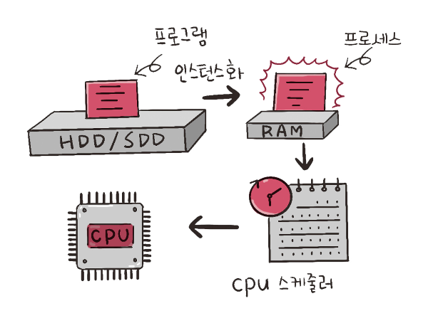

- 프로세스란 메모리에 올라와 실행되고 있는 프로그램을 의미한다.


## 3.3.1. 컴파일 과정

- 소스 코드가 프로그램이 되는 컴파일 과정은 다음과 같다.

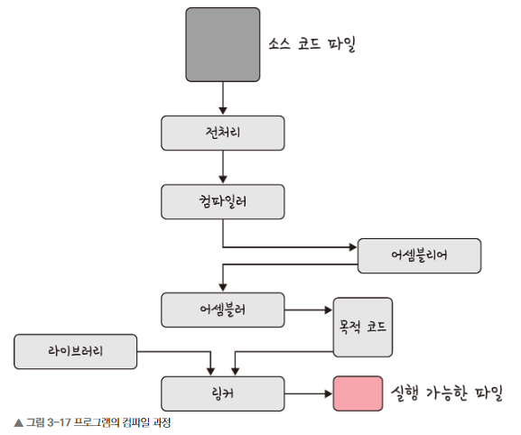

- 전처리 : 소스 코드의 주석을 제거하고, #include 등 헤더 파일을 병합하여 매크로를 치환한다.
- 컴파일러 : 오류 처리, 코드 최적화 작업을 하며 어셈블리어로 변환한다.
- 링커 : 프로그램 내에 있는 라이브러리 함수 또는 다른 파일들과 목적코드(object code)를 결합하여 실행 파일을 만든다. 실행파일은 `.exe` 혹은 `.out`이라는 확장자를 갖는다.


정적 라이브러리와 동적 라이브러리

- 정적 라이브러리는 프로그램 빌드시 라이브러리가 제공하는 모든 코드를 실행 파일에 넣는 방식이다.
- 동적 라이브러리는 프로그램 실행 시 필요할 때만 DLL이라는 함수 정보를 통해 참조하는 방식이다.


## 3.3.2. 프로세스의 상태


**생성 상태**

- 생성 상태(create)는 프로세스가 생성된 상태를 의미한다, `fork()` 또는 `exec()` 함수를 통해 생성한다. PCB(Process Control Block)이 할당된다.
- `fork()`는 부모 프로세스의 주소 공간을 그대로 복사하며, 새로운 자식 프로세스를 생성하는 함수이다. 주소 공간만 복사할 뿐이지, 부모 프로세스의 비동기 작업 등을 상속하지는 않는다.

- `exec()`은 새롭게 프로세스를 생성하는 함수이다.


**대기상태**

- CPU 스케줄러로부터 CPU 소유권이 넘어오기를 기다리는 상태


**대기 중단 상태**

- 대기 중간 상태(Ready Suspended)는 메모리 부족으로 일시 중단된 상태이다.


**실행상태**

- CPU 소유권과 메모리를 할당받고, 인스트럭션을 수행 중인 상태이다. CPU burst가 일어났다고 표현하기도 한다.


**중단(Blocked) 상태**

- 일반적으로 I/O 디바이스에 의한 인터럽트로 인해 발생한다. 어떠한 응답을 기다리며 프로세스가 차단된 상태이다.


**일시 중단 상태**

- 중단 상태가 끝나고 다시 프로세스가 실행되려 했지만 메모리 부족으로 일시 중단된 상태이다.


**종료 상태**

- 프로세스가 종료된 상태이다.


## 3.3.3. 프로세스의 메모리 구조

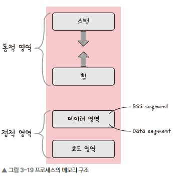

- 위에서부터 스택, 힙, 데이터 영역(BSS segment, Data segment), 코드 영역(Code segment)로 나뉘어 진다. 스택은 위 주소부터 할당되고, 힙은 아래 주소부터 할당된다.

**스택**

- 스택에는 지역변수, 매개변수, 함수가 저장되고 컴파일 시에 크기가 결정되며, "동적"인 특징을 갖는다.
- 스택 영역은 함수가 함수를 호출하면서 동적으로 크기가 늘어날 수 있다. — *흔히 콜스택이 쌓인다고 표현하는* — 이때 힙과 스택의 메모리 영역이 곂치면 안되기에 그 사이에는 공간을 비워 놓는다.


**힙**

- 힙은 동적 할당할 때 사용되며 런타임 시 크기가 결정된다. 예를 들어 벡터 같은 동적 배열은 당연히 힙에 동적 할당된다. 힙은 "동적"인 특징을 가진다.


**데이터 영역**

- 데이터 영역은 전역 변수, 정적 변수가 저장되고, 정적인 특징을 갖는 프로그램이 종료되면 사라지는 변수가 들어있는 영역이다.
- BSS segment와 data segment로 나뉘는데, BSS segment에서는 초기화 되지 않은 변수가 0으로 초기화되어 저장되며, Data segment에서는 0이 아닌 다른 값으로 할당된 변수들이 저장된다.


**코드 영역**

- 코드 영역은 프로그램에 내장되어 있는 소스 코드가 들어가는 영역이다. 이 영역은 수정 불가능한 기계어로 저장되어 있으며 정적인 특징을 가진다.


## 3.3.4. PCB

- PCB(Process Control Block)는 운영체제에서 프로세스에 대한 메타데이터를 저장한 "데이터"를 말한다. 프로세스 제어 블록이라고도 한다. 프로세스가 생성되면 운영체제는 해당 PCB를 생성한다.
- 프로그램이 실행되면 프로세스가 생성되고, 프로세스 주소 값들에 앞서 설명한 스택, 힙 등의 구조를 기반으로 메모리가 할당된다.
- 그리고 이 프로세스의 메타데이터들이 PCB에 저장되어 관리된다. 이는 프로세스의 중요한 정보를 포함하고 있기 때문에 일반 사용자가 접근하지 못하도록 커널 스택의 가장 앞부분에서 관린된다.


**PCB의 구조**

- 프로세스 스케줄링 상태: "준비", "일시 중단" 등 프로세스가 CPU에 대한 소유권을 얻은 이후의 상태
- 프로세스 ID: 프로세스 ID, 해당 프로세스의 자식 프로세스 ID
- 프로세스 권한: 컴퓨터 자원 또는 I/O 디바이스에 대한 권한 정보
- 프로그램 카운터 : 프로세스에서 실행해야 할 다음 명령어의 주소에 대한 포인터 
- CPU 레지스터 : 프로세스에서 실행하기 위해 저장해야 할 레지스터에 대한 정보
- CPU 스케줄링 정보 : CPU 스케줄러에 의해 중단된 시간 등에 대한 정보
- 계정 정보: 프로세스 실행에 사용된 CPU 사용량, 실행한 유저의 정보
- I/O 상태 정보: 프로세스에 할당된 I/O 디바이스 목록


**컨텍스트 스위칭**

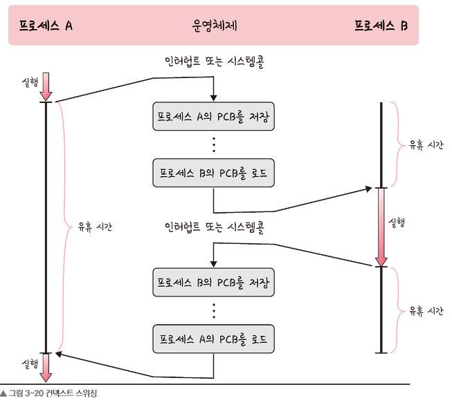


## 3.3.5. 멀티프로세싱

- 말그대로 여러 프로세스를 돌리는 것을 의미한다.


**웹 브라우저**


**IPC**

- 멀티프로세스로 구동하는 어플리케이션은 IPC를 통해 각가의 프로세스들이 정보를 주고 받고, 데이터를 공유한다. 
- IPC의 종류로는 공유 메모리, 파일, 소켓, 익명 파이프, 명명 파이프, 메시지 큐가 있다. 이들 모두 메모리가 "완전히 공유"되는 스레드보다는 속도가 떨어진다.


**공유 메모리**

- 여러 프로세스에 동일한 메모리 블록에 대한 접근 권한을 부여하여, 프로세스가 서로 통신할 수 있도록 공유 버퍼를 생성하는 것을 의미한다.

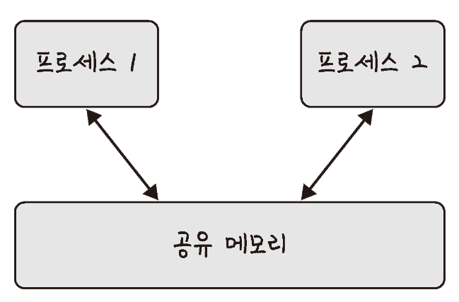

- 기본적으로 각 프로세스의 메모리를 다른 프로세스가 접근할 수 없지만 공유메모리를 둠으로써 여러 프로세스가 하나의 메모리를 공유하도록 할 수는 있다.


**파일**

- 파일을 기반으로 IPC가 가능하다는 얘기가 하고 싶은 건가. (솔직히 책 내용을 제대로 이해하진 못함)
- 대충 `process_1`이 `필담.txt`이라는 파일에 `hi! \n`라고 적어서 저장하고, 그걸 `process_2`가 읽는 방식으로 IPC는 가능할 것이다.


**소켓**

- 네트워크에 기반한 IPC를 의미한다. TCP와 UDP가 있다.


**언네임드 파이프**

- 프로세스 간에 FIFO 방식으로 읽히는 임시 공간인 파이프를 기반으로 데이터를 주고 받으며, 단방향 방식의 읽기 전용, 쓰기 전용 파이프를 만들어서 작동하는 방식을 말한다.


- 이는 부모, 자식 프로세스 간에만 사용할 수 있다.


**네임드 파이프**

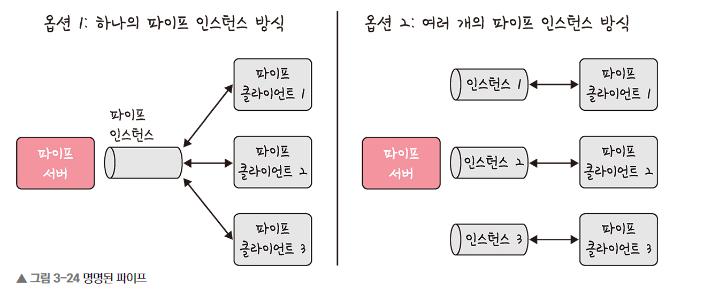

- 네임드 파이프는 파이프 서버와 하나 이상의 파이프 클라이언트 간의 통신을 위해 명명된 단방향 혹은 이중 파이프를 말한다. 


**메시지 큐**

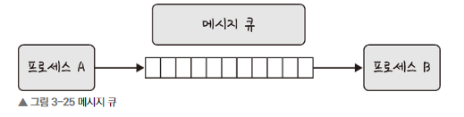

- 메시지 큐는 메시지를 큐 데이터 구조 형태로 관리하는 것을 의미한다.


## 3.3.6. 스레드와 멀티스레딩

**스레드**

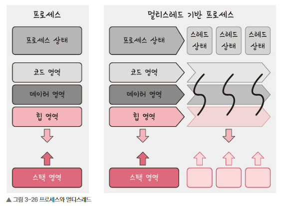


**멀티 스레딩**

- 스레드끼리는 코드 영역, 데이터 영역, 힙 영역을 공유하기 때문에 효율성이 높다. 

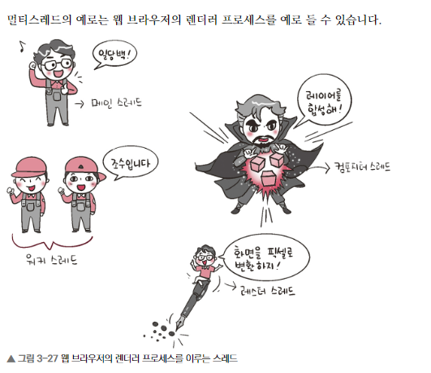


## 3.3.7. 공유 자원과 임계 영역

**Shared Resource**

- 여러 프로세스 및 스레드가 공유하는 리소스들을 의미 — 메모리, 파일,데이터, 프린터, 모니터 등.
- 이와 같은 Shared Resource를 두 개 이상의 프로세스가 동시에 점유하려는 상황을 Race condition이라 부른다.


**Critical section**

- Race Condition으로 인해 우리가 원하지 않는 결과를 야기하는 것을 Critical Section이라고 한다.

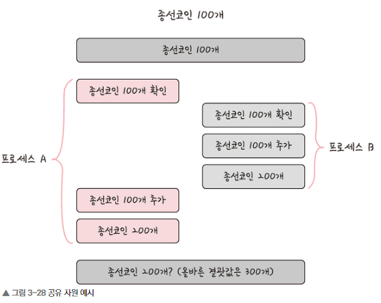

- 위 그림을 보면 `종선코인`이라는 리소스를 프로세스 A와 프로세스 B가 서로 점유하려는 상황에서 잘못된 결괏값인 `200`이 출력되었음을 알 수 있다. 이런 걸 Critical Section이라고 한다. 😒

- 뮤텍스, 세마포어, 모니터 등으로 이 문제를 해결한다.


**뮤텍스(: object)**

- 뮤텍스는 공유 자원을 사용하기 전에 설정하고 사용한 후에 해제하는 잠금이다.
- 잠금이 설정되면 다른 스레드는 잠긴 코드 영역에 접근할 수 없다.
- 뮤텍스는 `잠김` 혹은 `안잠김`이라는 binary한 상태만 가진다.

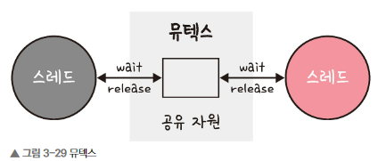


**세마포어(: int)**

- `wait` (P함수라고도 함)과 `signal` (V함수라고도 함)로 고융 자원에 대한 접근을 처리한다.
- `wait`은 자신의 차례를 기다리는 함수이다.
- `signal`은 자신의 차례가 끝나고 다음 프로세스에게 순서를 넘겨주는 함수이다.
- 프로세스가 Shared resource에 접근하면 세마포어에서 `wait()` 작업을 수행한다. 그리고 해당 프로세스가 공유자원을 할당받고 자기 볼 일 다 본 다음 공유 자원을 해제하면 세마포어에서 `signal()` 작업을 수행한다. 


## 3.3.8. 데드락

- 데드락은 두 개 이상의 프로세들이 서로 가진 자원을 기다리며 중단된 상태를 말한다.

```c
#include <stdio.h>
#include <pthread.h>
#include <unistd.h>
void *function1();
void *function2();
pthread_mutex_t first_mutex; // mutex lock
pthread_mutex_t second_mutex;
int main()
{
    pthread_mutex_init(&first_mutex, NULL); // initialize the lock
    pthread_mutex_init(&second_mutex, NULL);
    pthread_t one, two;
    pthread_create(&one, NULL, function1, NULL); // create thread
    pthread_create(&two, NULL, function2, NULL);
    pthread_join(one, NULL);
    pthread_join(two, NULL);
    printf("Thread joined\n");
}

void *function1()
{
    pthread_mutex_lock(&first_mutex); // to acquire the resource/mutex lock
    printf("Thread ONE acquired first_mutex\n");
    pthread_mutex_lock(&second_mutex);
    printf("Thread ONE acquired second_mutex\n");
    pthread_mutex_unlock(&second_mutex); // to release the resource
    printf("Thread ONE released second_mutex\n");
    pthread_mutex_unlock(&first_mutex);
    printf("Thread ONE released first_mutex\n");
}
void *function2()
{
    pthread_mutex_lock(&second_mutex);
    printf("Thread TWO acquired second_mutex\n");
    pthread_mutex_lock(&first_mutex);
    printf("Thread TWO acquired first_mutex\n");
    pthread_mutex_unlock(&first_mutex);
    printf("Thread TWO released first_mutex\n");
    pthread_mutex_unlock(&second_mutex);
    printf("Thread TWO released second_mutex\n");
}
```


# 3.4. CPU 스케줄링 알고리즘

## 3.4.1. 비선점형(Non-Preemptive)

- non-preemptive는 프로세스가 스스로 CPU 소유권을 포기하는 방식이다. 강제로 프로세스를 중지시키지 않으며 이로 인해 컨텍스트 스위칭으로 인한 부하가 적다.

**FCFS**

- First Come, First Served.
- 가장 먼저 온 것을 가장 먼저 처리하는 알고리즘이다. 
- 길게 수행되는 프로세스 때문에 대기가 길어지는 현상(convoy effect)가 발생하는 단점이 있다.


**SJF**

- 실행 시간일 짧은 프로세스를 가장 먼저 돌리는 알고리즘이다.


**우선순위**

- SJF에서는 긴 시간을 가진 프로세스가 실행되지 않는 현상이 있었다.
- 이는 오래된 작업일수록 우선순위를 높이는 방법을 통해 단점을 보완한 알고리즘이다.


## 3.4.2. 선점형(Preemptive)

- 현대 운영체제가 쓰는 방식이다. 
- 지금 사용하는 프로세스를 알고리즘에 의해 강제로 중단시켜버리고 강제로 다른 프로세스에 CPU 소유권을 할당하는 방식이다.


**라운드 로빈**

- 라운드 로빈은 각 프로세스에 동일한 할당 시간을 주고, 그 시간안에 끝나지 않으면 다시 Ready Queue로 보내버리는 알고리즘이다.


**SRF**

- SJF는 중간에 실행 시간이 더 짧은 작업이 들어와도, 일단 기존 작업을 다 처리하고 그 다음 짧은 작업을 이어나갔다.
- SRF에선 중간에 더 짧은 작업이 들어오면 현재 진행 중인 녀석을 중단하고, 더 짧은 녀석부터 처리한다.


**다단계 큐**

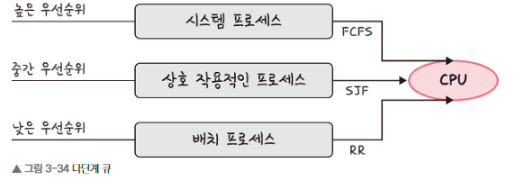

- 다단계 큐는 우선순위에 따른 준비 큐를 여러 개 사용하고, 큐마다 로운드 로빈이나 FCFS 등 다른 스케줄링 알고리즘을 적용한 것을 말한다. 큐 간의 프로세스 이동이 안 되므로 스케줄링 부담이 적지만 유연성이 떨어진다.


# 예상 질문

- 당일 공개 예정