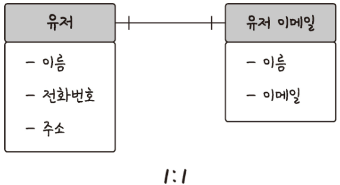
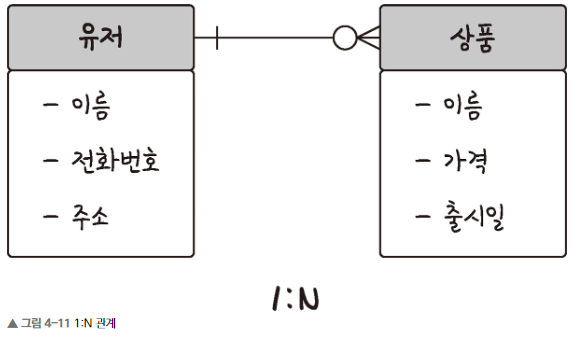
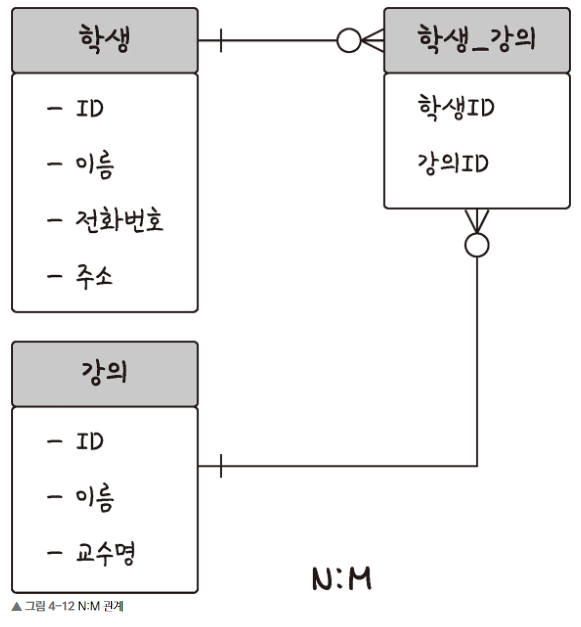
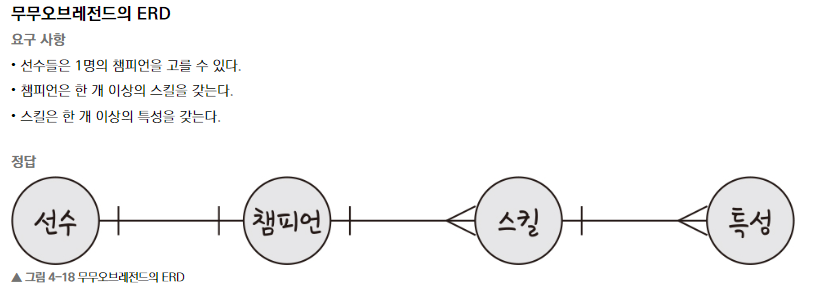
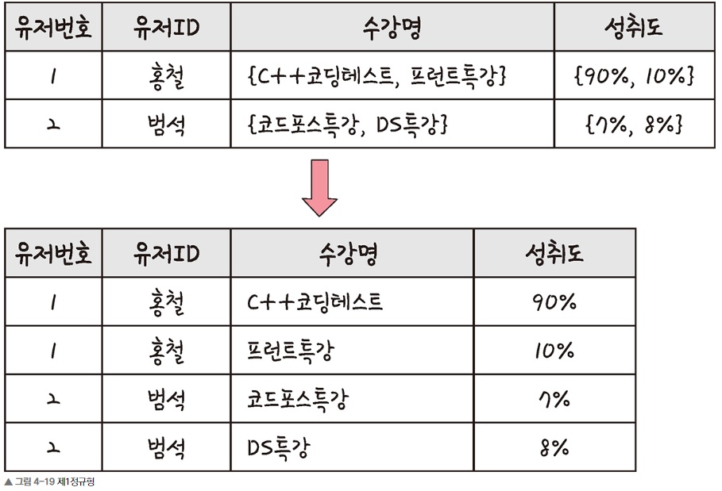
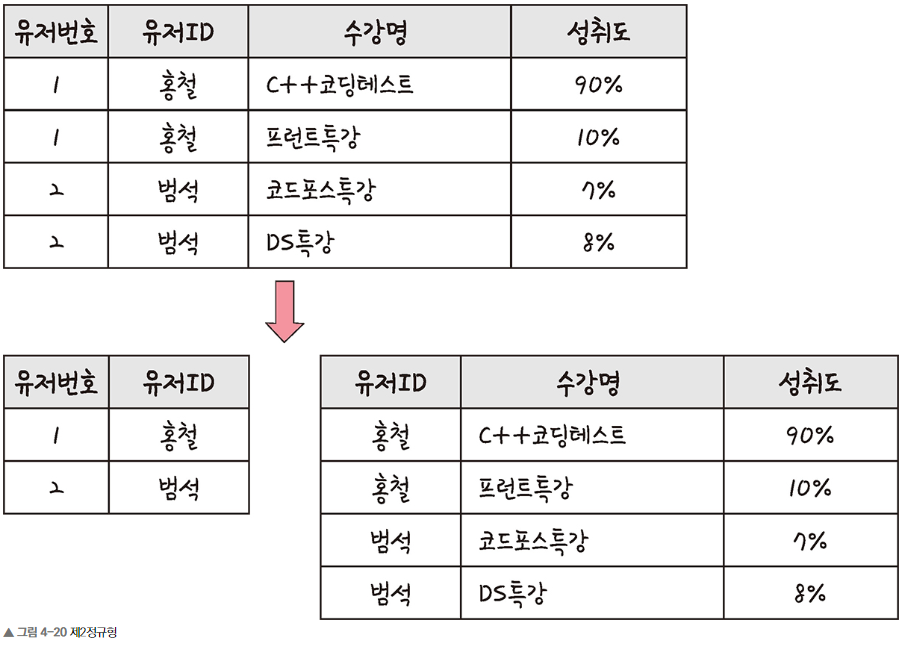
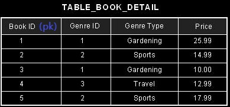
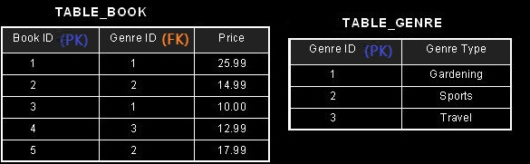

# 4. Database

## 4.1. 기본 개념

### 4.1.1. 엔티티(Entity)

**약한 엔티티 vs. 강한 엔티티**

- 단독으로 존재할 수 없고, 다른 엔티티에 dependency를 갖는다면 약한 엔티티가 된다.
- 예를 들어 방은 건물 내에서만 존재하기에 방은 약한 엔티티, 건물은 강한 엔티티가 된다.


### 4.1.2. 릴레이션

- SQL DB에서는 테이블, NoSQL에서는 컬렉션이라고 부른다.


**필드 타입** (MySQL 기준)

- `DATE` : 날짜는 있고, 시간은 없다. `1000-01-01~9999-12-31`
- `DATETIME`: 날짜와 시간 모두 있다. `1000-01-01 00:00:00` ~ `9999-12-31 23:59:59`
- `TIMESTAMP` : 날짜와 시간 모두 있다. `1970-01-01 00:00:01` ~ `2038-01-19 03:14:07`
- `CHAR(n)` : 최대 `n` 만큼의 글자를 입력할 수 있다. 단 크기가 고정된다. `n-1` 만큼의 글자를 입력해도  `n`글자 만큼의 바이트를 갖는다.
- `VARCHAR(n)` : 최대 `n`만큼의 글자를 입력할 수 있다. 크기가 가변적(variable)이다. 따라서 `n-1` 만큼의 글자를 입력하면 `n-1` 만큼의 용량을 갖는다.
- `TEXT` : 길이가 긴 문자열
- `BLOB` : blob객체를 저장.
- `ENUM` : `ENUM('babo', 'cheon-jae', 'young-jae')`라면, 해당 컬럼에 `'babo'`나 `'cheon-jae'`, `'young-jae'` 중에서 하나의 데이터만 들어갈 수 있다.
- `SET` : ENUM과 유사하지만, ENUM과 달리 여러 개의 데이터를 선택할 수 있다.









- N:M 관계에서는 두 엔티티를 직접 연결하기 보다는 **그 사이에 연결에 대한 정보를 담은 테이블**을 구축하게 된다. 
- 이유를 한 번 생각해보면 좋을 것이다.


### 4.1.3. 키


**Primary Key**

- 줄여서 PK라고 부르겠다.
- 테이블 안의 데이터를 식별하기 위해 사용되는 키이다.
- 따라서 고유해야 하며, 중복되어서는 안된다.


**Foreign Key**

- FK라고 부른다.
- 다른 테이블과의 관계를 식별하기 위해 사용된다.
- 따라서 FK는 다른 테이블에서는 PK로 사용될 수 있는 컬럼이어야 한다. (왜냐하면 관계를 식별하기 위해서는 관계를 식별하고자 하는 테이블안에서 데이터를 식별할 수 있어야 하기 때문)


## 4.2. ERD와 정규화 과정

- 말그대로 Entitity Relationship Diagram이다.


- 사원은 0~n 명의 고객을 관리한다.
- 고객은 0~n명의 주문을 넣을 수 있다.
- 주문에는 1~n개의 상품이 들어단다.





### 4.2.2. 정규화 과정

**1st Normalization**

- 릴레이션의 모든 도메인이 더 이상 분해될 수 없는 Atomic Value만으로 구성되어야 한다.




**2nd Normalization**

- Partial dependency를 없애는 작업이다. Partial dependecny란 복수의 컬럼의 조합으로 PK를 구성하는 테이블에서 PK를 구성하는 컬럼 중 일부 컬럼에만 의존성을 갖는 것을 의미한다.
- 위 표에서는 `{'유저ID', '수강명'}`이 `PK`의 역할을 한다고 볼 수 있다. 문제는 `유저번호`는 PK가 아닌 PK의 일부에 해당되는 `유저ID`에 대해서만 디펜던시를 갖는다는 것이다. 
- 따라서 별도로 분리를 해줘야 한다.




**3rd Normalization**






- **transitive functional dependency**를 없애는과정이다.
- PK가 아닌 컬럼에 의존성을 갖는 컬럼들을 따로 분리해주는 과정으로 이해하면 좋을 것같다.
- 위 예시가 이해에 도움을 주길 바란다.


## 4.3. 조인

```
pets
```

| ID   | NAME   | AGE  | OWNER_ID |
| :--- | :----- | :--- | :------- |
| 1    | Fido   | 7    | 1        |
| 2    | Missy  | 3    | 1        |
| 3    | Sissy  | 10   | 2        |
| 4    | Copper | 1    | 3        |
| 5    | Hopper | 2    | 0        |

```
owners
```

| ID   | NAME   | PHONE_NUMBER |
| :--- | :----- | :----------- |
| 1    | Johnny | 4567823      |
| 2    | Olly   | 7486513      |
| 3    | Ilenia | 3481365      |
| 4    | Luise  | 1685364      |


**1. Inner Join**

```sql
SELECT pets.name AS pet_name, owners.name AS owner
	FROM pets
	JOIN owners
	ON pets.owner_id = owners.id;
```

| PET_NAME | OWNER  |
| :------- | :----- |
| Fido     | Johnny |
| Missy    | Johnny |
| Sissy    | Olly   |
| Copper   | Ilenia |


**2. Left Join**

```
SELECT pets.name AS pet_name, owners.name AS owner
    FROM pets
    LEFT JOIN owners
    ON pets.owner_id = owners.id;
```


| PET_NAME | OWNER  |
| :------- | :----- |
| Fido     | Johnny |
| Missy    | Johnny |
| Sissy    | Olly   |
| Copper   | Ilenia |
| Hopper   | NULL   |


**3. Right Join**

```
SELECT pets.name AS pet_name, owners.name AS owner
    FROM pets
    RIGHT JOIN owners
    ON pets.owner_id = owners.id;
```


| PET_NAME | OWNER  |
| :------- | :----- |
| Fido     | Johnny |
| Missy    | Johnny |
| Sissy    | Olly   |
| Copper   | Ilenia |
| NULL     | Louise |


**4. Full Join**

```
SELECT pets.name AS pet_name, owners.name AS owner
    FROM pets
    FULL JOIN owners
    ON pets.owner_id = owners.id;
```


| PET_NAME | OWNER  |
| :------- | :----- |
| Fido     | Johnny |
| Missy    | Johnny |
| Sissy    | Olly   |
| Copper   | Ilenia |
| Hopper   | NULL   |
| NULL     | Louise |


