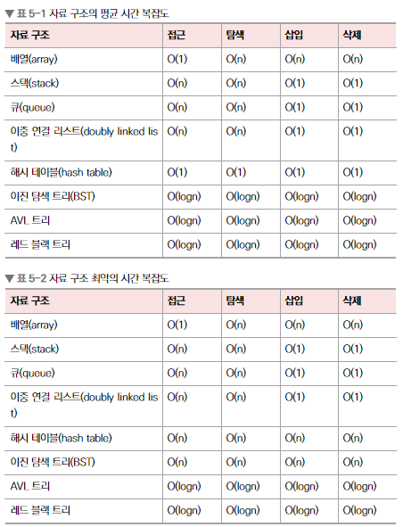
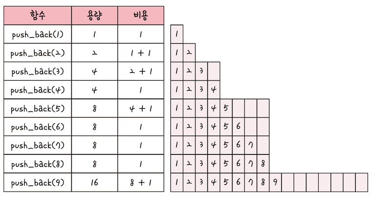

## 5.1. 복잡도

### 5.1.1 시간복잡도

```cpp
#include <bits/stdc++.h> // 헤더파일

using namespace std; // std라는 네임스페이스를 사용하겠다는 뜻
// 원래는 std::cin처럼 네임스페이스를 달아서 호출해야 하는데, 이를 기본으로 설정하겠다는 뜻이다.
string a; // 변수 선언

int main()
{
    cin >> a; // 입력
    cout << a << "\n"; // 출력
    return 0;
}
```

* 이렇게 만든 걸 실행한 후 wow라고 입력하면 wow가 출력된다. 


#### Big-O 

```python
def baz(n: int) -> int:
    foo: int = 1
    for _ in range(10):
        for _ in range(n):
            for _ in range(n):
                foo += 1

    for _ in range(10):
        foo += 1
    return foo
```

* 위의 함수 `baz`는 소요시간 $10n^2 + n$인 함수이다.

- 따라서 `baz`의 시간복잡도는 $O(n^2)$이 된다.
  - 가장 차수가 높은 항의 coefficient를 빼고, 나머지 term들은 빼버리면 된다.


### 5.1.2. 공간복잡도

```cpp
int a[1004];
```

- 배열 `a`는 `1004 * 4` 바이트의 크기를 가지게 된다.


### 5.1.3. 자료구조별 시간복잡도




## 5.2. 선형 자료 구조

### 5.2.1. Linked List

```cpp
#include <bits/stdc++.h>
using namespace std;
int main() {
    list<int> a;
    for (int i = 0; i < 10; i++) {
        a.push_back(i);
    } // 0, 1, 2, 3, 4, 5, 6, 7, 8, 9
    for (int i = 0; i < 10; i++ ) {
        a.push_front(i);
    // 9, 8, 7, 6, 5, 4, 3, 2, 1, 0, 0, 1, 2, 3, 4, 5, 6, 7, 8, 9
    }
    
    auto it = a.begin(); it++; 
    a.insert(it, 1000);
    for (auto it : a) {
        cout << it << " ";
    }
    cout << "\n";
    
    a.pop_front();
    a.pop_back();
    for (auto it : a) {
        cout << it << " ";
    }
    cout << "\n";
        
}
```

```bash
9 1000 8 7 6 5 4 3 2 1 0 0 1 2 3 4 5 6 7 8 9
1000 8 7 6 5 4 3 2 1 0 0 1 2 3 4 5 6 7 8
```

```c
struct node {
   int data;
   int key;
   struct node *next;
};

struct node *head = NULL;
struct node *current = NULL;

```


### 5.2.2. Array

```cpp
#include <bits/stdc++.h>
using namespace std; 
int a[10];
int main(){   
     for(int i = 0; i < 10; i++)a[i] = i; 
     for(auto it : a) cout << it << " ";
     cout << '\n'; 
    return 0;
}
/* 
0 1 2 3 4 5 6 7 8 9 
*/
```

* 배열은 같은 타입의 변수들로 구성되고, 크기가 정해져 있으며, 인접한 메모리 위치에 있는 데이터를 모아놓은 집합이다. 
* 탐색의 시간복잡도가 $O(1)$이며 랜덤접근이 가능하다.
* 삽입과 삭제에는 $O(n)$ 이 걸린다. 


### 5.2.3. 벡터

* 벡터는 동적으로 아이템을 할당할 수 있다. (동적 배열)
* 랜덤접근이 가능하다.
* 탐색과 맨 뒤의 요소를 삭제 혹은 삽입하는데는 O(1)이 걸린다.
* 맨뒤나 맨앞이 아닌 요소를 삭제하고 삽입할 때는 O(n)이 걸린다.




- $2^i + 1 \forall i \in \{0, 1, \cdots\}$마다 크기가 2배로 늘어남을 알 수 있다.


```cpp
#include <bits/stdc++.h>
using namespace std;
vector<int> v;
int main(){
    for(int i = 1; i <= 10; i++)v.push_back(i);
    for(int a : v) cout << a << " ";
    cout << "\n";
    v.pop_back();

    for(int a : v) cout << a << " ";
    cout << "\n";

    v.erase(v.begin(), v.begin() + 1);

    for(int a : v) cout << a << " ";
    cout << "\n";

    auto a = find(v.begin(), v.end(), 100);
    if(a == v.end()) cout << "not found" << "\n";

    fill(v.begin(), v.end(), 10);
    for(int a : v) cout << a << " ";
    cout << "\n";
    v.clear();
    for(int a : v) cout << a << " ";
    cout << "\n";

    return 0;
}
/*
1 2 3 4 5 6 7 8 9 10
1 2 3 4 5 6 7 8 9
2 3 4 5 6 7 8 9
not found
10 10 10 10 10 10 10 10
*/

```


### 5.2.4. 스택

- 선입후출의 자료구조이다.

```cpp
#include<bits/stdc++.h> 
using namespace std;  
stack<int> stk; 
int main() {
    ios_base::sync_with_stdio(false);
    cin.tie(NULL);
    for(int i = 0; i < 10; i++)stk.push(i);  
    while(stk.size()){
        cout << stk.top() << " ";
        stk.pop();
    } 
}
/* 
9 8 7 6 5 4 3 2 1 0
*/
```


### 5.2.5. 큐

- 선입선출의 자료구조이다.

```cpp
#include <bits/stdc++.h>
using namespace std;
int main(){
    queue<int> q;
    for(int i = 0; i < 10; i++)q.push(i);
    while(q.size()){
        cout << q.front() << " ";  
        q.pop();
    }  
    return 0;
}
/* 
0 1 2 3 4 5 6 7 8 9
*/
```


출처 

https://en.wikipedia.org/wiki/Time_complexity

https://www.tutorialspoint.com/data_structures_algorithms/linked_list_program_in_c.htm


