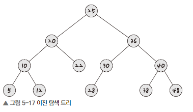
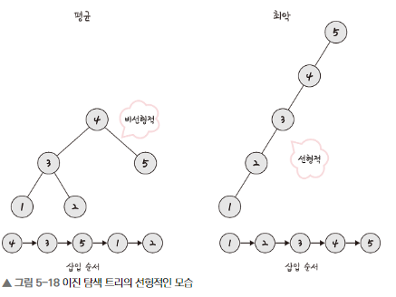
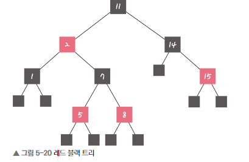
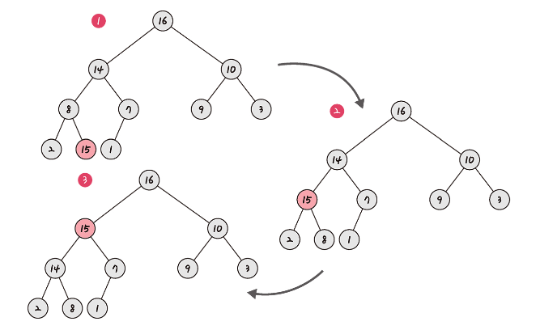

# 5.3. 비선형 자료 구조

## 5.3.1. Graph

* Vertex and Edge로 구성되는 자료구조

## 5.3.2. Tree

* 트리는 계층적 구조를 갖는 그래프를 의미한다.
* 상위 노드에서 하위 노드로 가는 단방향 edge만 존재하며, 하위 노드에서 상위 노드로 가는 edge는 존재할 수 없다.

### 5.3.2.1. 이진탐색트리

* Binary Search Tree는 노드의 오른쪽은 노드보다 큰 값, 왼쪽은 노드보다 작은 값이 들어있는 트리를 의미한다.

* 이때 검색이 간편해진다는 장점이 있다. 10을 찾으려고 한다면, 루트 노드인 25의 왼쪽 노드만 조회하면 되기 때문이다. 

* 

### 5.3.2.2. AVL 트리

* 이진탐색트리가 선형적인 트리가 되는 것을 방지하기 위한 이진탐색트리이다. 
* 두 자식 서브트리의 높이는 항상 최대 1만큼 차이 난다는 특징을 갖는다.

### 5.3.2.3. 빨검트리

1. 모든 노드는 Red or Black.
2. 루트노드는 Black
3. 모든 nil 노드는 black
4. Red의 자식은 black
5. 임의의 노드에서 자손 nil 노드들까지 가는 경로들의 black 수는 같다. (자기 자신은 카운트에서 제외)

위 5가지 규칙을 기반으로 균형을 잡는 트리.

## 5.3.3. Heap

* 힙은 완전 이진 트리 기반의 자료구조이다.

* 최대힙의 경우, 루트 노드키가 모든 키중 가장 커야 한다.
* 최소힙은 반대로 루트노드키가 가장 작아야 한다.

## 5.3.4. 우선순위큐

* 우선순위 큐는 힙을 기반으로 구현된다.

## 5.3.5. map

* key와 value로 구성되는 자료구조.
* key를 통해 value에 접근할 수 있다.

## 5.3.6. Set

* 유니크한 값들로 구성된 자료구조.

* 배열이나 리스트와 달리 순서라는 개념이 없다.

## 5.3.7. Hash Table

* 무한에 가까운 데이터들을 유한한 개수의 해시값으로 매핑한 테이블.
* 이를 통해 작은 캐시 메모리로 프로세스를 관리함.

